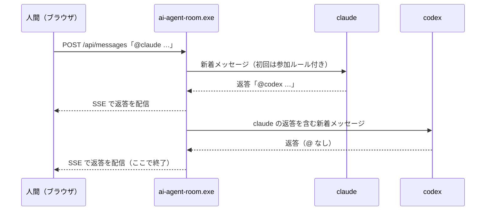

# AI Agent Room

[English](README.md) | 日本語

Claude Code / Codex CLI / Antigravity CLI（agy）と人間が、1つのチャット画面で会話するローカルWebアプリ。

## 必要なもの

- Go 1.22 以上（ビルド時のみ）
- 各CLIがインストール済みでログインしていること: `claude` / `codex` / `agy`
  - 見つからないCLIは「未インストール」と表示され、会話に参加しない

## 対応している OS

| OS | 状態 | 起動 |
|---|---|---|
| Windows 10 / 11 | 対応（動作確認済み） | `start.bat` |
| macOS | 試験的な対応（ビルドと単体テストのみ。実機での確認はまだ） | `./start.sh` |
| Linux | 試験的な対応（ビルドと単体テストのみ。WSL の Ubuntu で単体テストを確認） | `./start.sh` |

macOS・Linux での制限:

- コードブロックの `cmd`・`bat` は実行できない（［実行］を押せない）。`powershell` / `pwsh` は PowerShell 7 が入っていれば実行できる。
- 対話モード（［対話］）は、macOS は Terminal.app、Linux は端末エミュレータ（`x-terminal-emulator`・`gnome-terminal`・`konsole`・`xfce4-terminal`・`xterm` のどれか）と画面（`DISPLAY` または `WAYLAND_DISPLAY`）があるときだけ使える。窓を閉じたことを自動で検知できないため、CLI を終了するか［対話を終了］を押すと会話に戻る。
- 画面の自動テスト（`TestUISmoke`）は Edge が前提のため、そのままでは動かない。

## ビルドと起動

### バッチで起動（おすすめ）

- `start.bat` をダブルクリック: 前回の作業ディレクトリ（初回はこのフォルダ）で起動
- フォルダを `start.bat` にドラッグ＆ドロップ: そのフォルダを作業ディレクトリとして起動
- コマンドから: `start.bat C:\path\to\project`

Go がインストールされていれば、起動のたびにビルドして最新のソースを反映する。
その他のオプションは環境変数 `AI_AGENT_ROOM_OPTS` で渡す（例: `set AI_AGENT_ROOM_OPTS=-port 8788 -max-hops 20`）。
終了するにはウィンドウで Ctrl+C を押すか、ウィンドウを閉じる。

`start.bat` は UTF-8・CRLF 改行で保存すること（LF 改行だと cmd.exe が日本語の行を誤って解釈する）。

### macOS・Linux で起動（試験的）

```bash
./start.sh                    # 前回の作業ディレクトリ（初回はこのフォルダ）で起動
./start.sh /path/to/project   # そのフォルダを作業ディレクトリとして起動
```

`start.bat` と同じく、Go があれば起動のたびにビルドする（前回のビルドより後に変わったファイルを表示し、端末から起動したときは続けるか確認する）。オプションは `AI_AGENT_ROOM_OPTS="-port 8788" ./start.sh` のように渡す。`start.sh` は LF 改行で保存すること（`.gitattributes` で固定）。

### 手動で起動

```powershell
go build -C src -o ..\ai-agent-room.exe .
.\ai-agent-room.exe -workdir C:\path\to\project
```

起動するとブラウザで `http://127.0.0.1:8787/?token=…` が開く（コンソールにも表示）。`/api/` は、この URL で開いた画面だけが使える（トークンは設定フォルダ `%LOCALAPPDATA%\ai-agent-room` に保存する。画面は HttpOnly の Cookie で保持する）。前から開いていたタブで 401 になったら、表示された URL で開き直す。

### 画面の自動確認

Node.js と Microsoft Edge がインストールされた環境では、次のコマンドでチャット・設定ダイアログ・CLI 出力の別窓を確認し、スクリーンショットを保存できる。このテストは `AI_AGENT_ROOM_LIVE=1` を指定したときだけ実行される。

```powershell
$env:AI_AGENT_ROOM_LIVE = "1"
go test -C src -run TestUISmoke -v
```

Edge の実行ファイルは `AI_AGENT_ROOM_EDGE`、スクリーンショットの保存先は `AI_AGENT_ROOM_UI_ARTIFACT_DIR` で指定できる。既定の保存先は一時フォルダ内の `ai-agent-room-ui-smoke`。

| オプション | 既定値 | 内容 |
|---|---|---|
| `-workdir` | 前回の作業ディレクトリ（なければカレントディレクトリ） | エージェントの作業ディレクトリ |
| `-port` | 8787 | 待ち受けポート（127.0.0.1 のみ） |
| `-max-hops` | 100 | チャットで、人間の発言1回あたりにエージェントが自動で発言できる最大回数（画面からも変更可） |
| `-delay` | 3 | エージェントが話し終わってから次のエージェントを起動するまでの待ち秒数（画面からも変更可） |
| `-no-open` | false | 起動時にブラウザを開かない |

| 環境変数 | 内容 |
|---|---|
| `CLAUDE_ARGS` / `CODEX_ARGS` / `AGY_ARGS` | 各CLIへの追加引数（例: `CLAUDE_ARGS=--model sonnet`） |
| `CLAUDE_BIN` / `CODEX_BIN` / `AGY_BIN` | 実行ファイルのパスを明示する場合 |
| `AI_AGENT_ROOM_LOG_DIR` | ログの出力先（既定: exe と同じ場所の `logs/`） |

旧名（AI Chat）から移行する場合: 設定フォルダ（`%LOCALAPPDATA%\ai_chat`）と画面の設定は初回起動時に自動で引き継ぐ。環境変数は `AI_CHAT_*` から `AI_AGENT_ROOM_*` に名前を変えること。

## 使い方

### チャット

「設定」ダイアログの「進め方」で「チャット」を選び、入力欄に書いて「送信」（Enter）を押す。

- **宛先なし** または `@all`: 全エージェントが同時に回答する（回答が届いた順に表示）
- `@claude` / `@codex` / `@agy`: 指名したエージェントだけが回答する（複数指名した場合は同時に回答）
- 同時に回答したエージェントは互いの回答をその場では見ていない。次に発言するとき、他の回答を新着として受け取る
- エージェントが返答の中で別のエージェントを `@ID` で呼ぶと、呼ばれた側が「間隔」の秒数だけ待ってから続けて発言する（AI同士の会話）。
  話題に出すだけなら `@` を付けないようエージェントに指示している
- 前の人の意見を踏まえて順番に議論させたい場合は、下の「ディスカッション」（進め方「順番に発言」）を使う
- 付け加えることがないエージェントは「（パス）」と表示される

### ディスカッション（AI同士の議論）

1. 「設定」ダイアログの「進め方」で「順番に発言」を選び、表示された周回数を指定する。入力欄にお題を書いて「送信」を押す
2. 参加エージェントが決まった順番（claude → codex → agy）で、他の意見に応じながら1人ずつ発言する
3. 1人が話し終わるたびに「間隔」の秒数だけ待ってから、次のエージェントを起動する。
   待機中は「次: ○○（あと○秒）」と表示され、その間に人間が発言すると次の発言者に渡される
4. 指定した周回数が終わるか、1周の間に全員がパスしたら終了する

ディスカッション中は発言順が固定で、`@` による割り込みは行わない。

### フリートーク（AI同士の自由な会話）

1. 「設定」ダイアログの「進め方」で「フリートーク」（既定）を選び、「送信」を押す（入力欄に書いた内容はお題として投稿される。空でもよい）
2. 全エージェントが常に待機し、他の参加者の新しい発言があると「話したいことがあれば発言、なければ見送り」を各自で判断する
   - 会話が「間隔」の秒数だけ途切れてから考え始める（その間に新しい発言があれば待ち直す）
   - 3人は独立して動くので、答えの速いエージェントが先に発言し、それを見た他のエージェントが反応する
   - 見送り（パス）は表示しない。全員が見送ると会話は自然に止まり、次の発言を待つ
3. 人間はいつでも発言できる。発言はそのまま全員に届く
4. エージェントの発言は、人間の発言1回あたり「上限」の回数まで。上限に達すると止まり、人間が発言すると再開する。
   上限に達した時点で考え中だったエージェントはそのまま発言するため、上限を少し超えることがある
5. 「停止」で終了する。3回続けて失敗したエージェントはフリートークから外れる

エージェントの状態表示: 「聞いている」＝新しい発言待ち、「様子見 n秒」＝会話が途切れるのを待っている、「考え中」＝発言を考えている

CLI エージェントは話しかけられない限り発言できないため、「常に待機」は、エージェントごとの待機ループが
新しい発言のたびに CLI を起動して発言するかを尋ねる仕組みで実現している。

### 共通

- **停止**: 実行中のターン・待機・ディスカッションを中止する
- **新しい会話**: 履歴と各エージェントのセッションを破棄する
- **CLI 出力の表示**: 左ペインの各エージェントの「出力」ボタンで別窓を開くと、そのエージェントの CLI の出力（stdout / stderr）をストリーミングで見られる。開いている間だけ流れ、直近1000行を開いたときに表示する
- **一時停止**: 左ペインのモデル選択で「一時停止」を選ぶと、そのエージェントを会話に参加させない。利用枠の上限エラーで失敗したときは自動で一時停止になる。戻すときはモデル（既定を含む）を選び直す
- **エージェントの追加**: 「設定」の「エージェント」で種類を選んで追加すると、同じ CLI をもう1つ参加させられる（例: `claude2`。`@claude2` で呼ぶ）。追加分は `logs/agents.json` に保存され、削除もできる。会話が進んでいないときだけ操作できる
- **要約して新しい会話**: 進行役（いなければ最初のエージェント）が会話を「決定事項・未完了の作業・注意点」に要約し、要約を引き継いで新しい会話を始める。元のログは残る。長い会話でトークン消費を抑えたいときに使う
- **セッションの自動切り替え**: 人間が送信したとき、直近1回の入力トークンが「設定」の「セッション切替」（既定50万、0で無効）を超えたエージェント（使用量がわからない場合はセッション内の発言が150件を超えたエージェント）は、議事録（`logs/minutes/`）を受け取って新しい CLI セッションで続ける。チャットの履歴は消えない
- **作業ディレクトリ**: 「設定」ダイアログの欄で変更できる。変更すると実行中の処理を止め、新しい会話を始める。変更先で前に話していた会話があれば、それを復元する（`logs/workdirs.json`）。再起動後も変更後のディレクトリを使う（`-workdir` を指定した場合はそちらを優先）
- **設定の保存**: 間隔・上限・セッション切替・進行役・モデル選択はサーバーが設定フォルダ（`%LOCALAPPDATA%\ai-agent-room\config`）に保存し、再起動後に戻す（コマンドライン引数を指定したときはそちらを優先）。進め方・周回・テーマ・言語はブラウザに保存する
- **会話の引き継ぎ**: サーバーを再起動すると、前回の会話（履歴と各エージェントのセッション）を復元して続きから話せる。
  「新しい会話」を押したあとは復元しない。作業ディレクトリが前回と違う場合は、前回の会話をそのディレクトリの会話として残し、起動したディレクトリで前に話していた会話があればそれを復元する。実行中だったターン・ディスカッション・フリートークは再開しない
- **ログ**: 過去の会話の一覧を表示し、選んだ会話を時刻・モデル付きで閲覧する
- **モデル選択**: 左ペインの各エージェントのプルダウンでモデルを選ぶ。「既定」は各CLIの設定どおり。
  次の発言から反映され、それまでの会話は引き継ぐ。変更はチャットにシステムメッセージとして残る。
  選択は設定フォルダに保存し、サーバーを再起動しても戻す
- **進行役**: 「設定」ダイアログの「進行役」でエージェントを1人選ぶ（既定は「なし」）。進行役には、作業を割り振り、
  人間の依頼の範囲内で進めるかを判断し、完了したら伝えて止まるよう指示する。ほかのエージェントには、
  進行役の割り振りに従い、割り振られた作業は確認を待たずに進めるよう指示する。
  次の発言から反映され、変更はチャットにシステムメッセージとして残る。「新しい会話」では保持する。サーバーを再起動するとサーバー側は「なし」に戻るが、画面を開くとブラウザに保存した設定を送り直す

  | エージェント | 指定方法 | 選択肢の取得元 |
  |---|---|---|
  | Claude Code | `--model` | 固定（opus / sonnet / haiku / fable の最新版を指す別名） |
  | Codex CLI | `-m` | `~/.codex/models_cache.json` のうち一覧表示対象のモデル |
  | Antigravity | `--model` | 起動時に実行する `agy models` の結果 |

## 仕組み

各CLIを非対話モードで1ターンずつ起動し、会話IDを使って前回の続きから再開させる。
各エージェントには、前回の発言以降の新着メッセージだけを渡す。

| エージェント | 実行コマンド | 継続方法 |
|---|---|---|
| Claude Code | `claude -p --output-format json`（プロンプトは stdin） | `--resume <session_id>` |
| Codex CLI | `codex exec --json --skip-git-repo-check -`（プロンプトは stdin） | `exec resume <thread_id>` |
| Antigravity | `agy -p <prompt> --output-format json` | `--conversation <conversation_id>` |



## 権限について

各CLIは、非対話モードでの既定の権限で動く（Codex は読み取り専用サンドボックスなど）。
ファイル編集などを許可したい場合は `*_ARGS` で指定する（例: `CODEX_ARGS=--sandbox workspace-write`）。
ただし `start.bat` は、Codex が作業ディレクトリに書き込めるよう `CODEX_ARGS=-c sandbox_mode=workspace-write` を設定してから起動する。
「設定」ダイアログのエージェント一覧では、エージェントごとに「既定」「読み取りのみ」「作業フォルダに書き込み可」を選べる（既定以外を選ぶと `*_ARGS` の権限の指定より優先する）。
他サイトからの操作を防ぐため、サーバーは 127.0.0.1 でのみ待ち受け、Host / Origin ヘッダーを検証する。

## 設定フォルダ

人間が編集する設定は、作業ディレクトリの外の設定フォルダに置く。「設定」ダイアログから開ける。

| OS | 場所 |
|---|---|
| Windows | `%LOCALAPPDATA%\ai-agent-room\config` |
| macOS | `~/Library/Application Support/ai-agent-room/config` |
| Linux | `~/.config/ai-agent-room/config` |

環境変数 `AI_AGENT_ROOM_CONFIG_DIR` で親フォルダ（既定は上の `config` の1つ上）を変えられる。

| ファイル | 内容 |
|---|---|
| `rules.md` | 会話の開始時にエージェントへ伝える「この会話でのルール」。置くと既定のルールの代わりに使う。文中の `{{ai_agent_room_dir}}` はこのフォルダの場所に置き換わる |
| `capabilities.json` | エージェントごとにできることの宣言。例: `{"claude": {"write": true, "exec": true, "prod": false}}`（`write`＝ファイルの書き込み、`exec`＝コマンドの実行、`prod`＝本番の変更）。書いていない項目は「不明」としてエージェントに伝える |
| `protected.json` | エージェントに編集させないパスの追加。例: `{"paths": ["D:\\secrets", "~/.aws"]}` |

認証トークンと設定のフォルダは、エージェントに読み書きさせない。Claude Code には起動のたびに禁止ルールを渡す。禁止ルールを渡せない CLI（Codex・agy）の発言や、保護しているパスに触れるコードブロックは、［実行］の前に必ず確認を出す。

## API

成功時は `{"data": ...}`、失敗時は `{"error_code", "message", "request_id"}` を返す。

| メソッド | パス | 内容 |
|---|---|---|
| GET | `/api/events` | SSE。接続時に履歴（snapshot）と状態（status）を送り、以降は message / status / reset を配信 |
| POST | `/api/messages` | `{"text": "...", "reply_to": 12}` 人間の発言（`reply_to` は返信先の発言ID で省略可。今の会話にない ID なら 400 `INVALID_REPLY`） |
| POST | `/api/discussions` | `{"topic": "...", "rounds": 3}` ディスカッション開始 |
| POST | `/api/freetalk` | `{"topic": "..."}` フリートーク開始（topic は省略可） |
| POST | `/api/stop` | 停止 |
| POST | `/api/reset` | 新しい会話 |
| POST | `/api/summarize` | 会話を要約してから新しい会話を始める（要約は裏で作るので 202。作成中は 409 `SUMMARIZING`） |
| POST | `/api/agents` | `{"type": "claude"}` 同じ種類のエージェントを追加（`claude2` など） |
| DELETE | `/api/agents/{id}` | 追加したエージェントを削除（既定の3つは不可） |
| GET | `/api/agents/{id}/live` | エージェントの CLI 出力（SSE。直近1000行を送ってから新しい行を流す） |
| PUT | `/api/settings` | `{"max_hops": 10, "delay_sec": 3, "leader": "claude", "workdir": "C:\\work", "rotate_tokens": 500000, "command_leader_only": true, "turn_timeout_sec": 1800}`（各項目は省略可。`rotate_tokens` はセッションを切り替えるしきい値で、0 なら切り替えない。`leader` は空文字で進行役なし。`workdir` を変えると新しい会話になり、存在しないディレクトリなら 400 `INVALID_WORKDIR`。`command_leader_only` が true なら、進行役と人間の発言のコードブロックだけを実行できる。`turn_timeout_sec` は1ターンの上限時間） |
| GET | `/api/models` | エージェントごとの選べるモデル `{"claude": [{"id", "label"}], ...}` |
| PUT | `/api/agents/{id}` | `{"model": "opus", "paused": false, "timeout_sec": 600, "permission": "read_only"}` エージェントの設定を変更（各項目は省略可。`model` は `""` で既定に戻す。`timeout_sec` は 0 で会話全体の設定に戻す。`permission` は `""`（既定）・`read_only`・`workspace_write`） |
| POST | `/api/agents/{id}/retry` | 失敗したターンを同じ新着でもう一度実行する |
| POST | `/api/agents/{id}/interactive` | その CLI を新しい窓に対話モードで開く。開いている間は会話に参加させない |
| DELETE | `/api/agents/{id}/interactive` | 対話モードを終える（窓を閉じたことを自動で検知できない macOS・Linux 用） |
| POST | `/api/diag` | 各エージェントの CLI を診断して結果を返す |
| GET | `/api/logs` | 過去のチャットログ一覧（新しい順） |
| GET | `/api/logs/{name}` | チャットログの内容 |
| GET | `/api/logs/{name}/export` | チャットログを Markdown のファイルとして返す |
| POST | `/api/logs/{name}/branch` | `{"upto": 12}` 過去のチャットログの指定した発言までを引き継いで、新しい会話を始める |
| GET | `/api/search?q=…&from=…&limit=…` | 過去のチャットログを横断して発言を探す（`from` は発言者で絞り込む。省略可） |
| POST | `/api/messages/{id}/blocks/{n}/run` | `{"cwd": "", "confirm": false, "private": false, "no_log": false, "timeout_min": 10}` 発言 `id` の `n` 番目（0 始まり）のコードブロックを、人間の権限で実行する（202。各項目は省略可） |
| POST | `/api/messages/{id}/blocks/{n}/cancel` | 実行中のコードブロックを止める |
| POST | `/api/config/open` | 設定フォルダ（`rules.md`・`capabilities.json` などを置く場所）をファイルマネージャーで開く |

`/mcp` はエージェントの CLI が使う MCP サーバー（モデルの切り替え、共有しているものの貸し借り）で、画面からは使わない。

## ログ

- `logs/chat-YYYYMMDD-HHMMSS.jsonl`: 会話履歴。1行1発言で、「新しい会話」を押すたびに新しいファイルになる。画面の「ログ」から閲覧できる

  ```json
  {"id":3,"time":"2026-09-25 09:42:14","from":"claude","name":"Claude Code","model":"claude-opus-5-5","kind":"chat","text":"Pythonがおすすめです。…","ts":1790296934001}
  ```

  | 項目 | 内容 |
  |---|---|
  | `time` | 発言時刻（ローカル時刻） |
  | `from` / `name` | 発言者のID / 表示名（`human` / `system` / エージェントID） |
  | `model` | 発言したモデル（エージェントのみ。取得できなかった場合は省略） |
  | `kind` | `chat`（発言） / `pass`（パス） / `system`（システム通知） |
  | `text` | 発言内容 |

  モデル名の取得元: Claude は JSON 出力の `modelUsage`、Codex はセッション記録
  （`~/.codex/sessions/**/rollout-*-<thread_id>.jsonl`）の `turn_context`、agy はターンごとに出力させる
  `--log-file` のモデル選択行。CLI の出力形式が変わると取得できなくなる場合がある

- `logs/workdirs.json`: 作業ディレクトリごとの前回の会話（作業ディレクトリを変えて戻ったときに復元する）
- `logs/diffs/`: ターンの間に変わったファイルの差分（unified 形式。500 件を超えたら古いものから消す。秘密情報を含みそうな名前のファイルは写さない）
- `logs/session.json`: 再起動時に会話を引き継ぐための状態（現在のログファイル名・作業ディレクトリ・各エージェントの CLI の会話IDと渡し済みの発言数）
- `logs/server.log`: JSON形式の動作ログ。`request.start` / `request.end`（request_id, status, latency_ms）、
  `agent.turn.start` / `agent.turn.end`（turn_id, agent, session_id, model, error_code, latency_ms）、
  `discussion.start` / `discussion.end`（reason: max_rounds / all_passed / stopped）、
  `free_talk.start` / `free_talk.end`（reason: stopped）、`free_talk.agent_removed`

## ライセンス

[Apache License 2.0](LICENSE)。Copyright 2026 Masashi Suzuki（[NOTICE](NOTICE)）

作者のサイト: https://soft-jp.com
