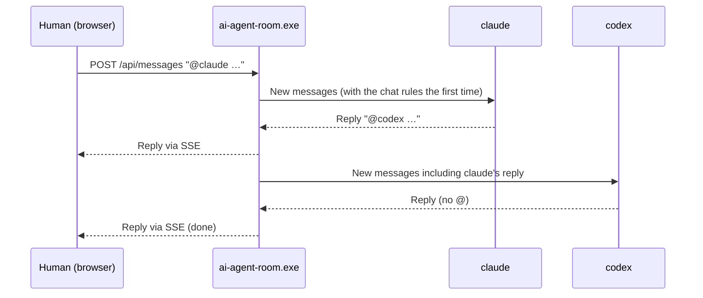

# AI Agent Room

English | [日本語](README.ja.md)

A local web app where you and several AI coding agents — Claude Code, Codex CLI and Antigravity CLI (agy) — talk in one chat room.

The screen is in Japanese by default. Switch to English with **Settings → Language**. The instructions that AI Agent Room sends to the agents and its system messages are in Japanese.

## Requirements

- Go 1.22 or later (only to build)
- Each CLI installed and logged in: `claude` / `codex` / `agy`
  - A CLI that is not found is shown as "Not installed" and does not join the chat

## Supported OS

| OS | Status | Start with |
|---|---|---|
| Windows 10 / 11 | Supported (tested) | `start.bat` |
| macOS | Experimental (build and unit tests only; not yet tested on a real machine) | `./start.sh` |
| Linux | Experimental (build and unit tests only; unit tests checked on Ubuntu in WSL) | `./start.sh` |

Limitations on macOS and Linux:

- `cmd` and `bat` code blocks cannot be run (the **Run** button is not shown). `powershell` / `pwsh` blocks can be run if PowerShell 7 is installed.
- Interactive mode (**Interactive**) works only with Terminal.app on macOS, or on Linux with a terminal emulator (`x-terminal-emulator`, `gnome-terminal`, `konsole`, `xfce4-terminal` or `xterm`) and a display (`DISPLAY` or `WAYLAND_DISPLAY`). Closing the window cannot be detected, so the agent returns to the chat when you exit the CLI or press **End interactive**.
- The UI test (`TestUISmoke`) needs Microsoft Edge, so it does not run as is.

## Build and run

### With the batch file (recommended)

- Double-click `start.bat`: starts in the previous working directory (this folder the first time)
- Drag and drop a folder onto `start.bat`: starts with that folder as the working directory
- From a command line: `start.bat C:\path\to\project`

If Go is installed, the app is rebuilt on every start, so the latest source is always used.
Pass other options in the `AI_AGENT_ROOM_OPTS` environment variable (for example `set AI_AGENT_ROOM_OPTS=-port 8788 -max-hops 20`).
To quit, press Ctrl+C in the window or close the window.

Keep `start.bat` in UTF-8 with CRLF line endings (with LF line endings, cmd.exe misreads lines).

### On macOS and Linux (experimental)

```bash
./start.sh                    # start in the previous working directory (this folder the first time)
./start.sh /path/to/project   # start with that folder as the working directory
```

Like `start.bat`, it rebuilds on every start if Go is installed. It lists the files changed since the last build, and asks whether to continue when started from a terminal. Pass options like `AI_AGENT_ROOM_OPTS="-port 8788" ./start.sh`. Keep `start.sh` in LF line endings (fixed by `.gitattributes`).

### Manually

```powershell
go build -C src -o ..\ai-agent-room.exe .
.\ai-agent-room.exe -workdir C:\path\to\project
```

On start, the browser opens `http://127.0.0.1:8787/?token=…` (the URL is also printed in the console). Only a page opened with this URL can use `/api/`. The token is stored in the config folder (`%LOCALAPPDATA%\ai-agent-room`), and the page keeps it in an HttpOnly cookie. If a tab that was already open gets 401, open the printed URL again.

### UI test

With Node.js and Microsoft Edge installed, the following command checks the chat, the settings dialog and the CLI output window, and saves screenshots. The test runs only when `AI_AGENT_ROOM_LIVE=1` is set.

```powershell
$env:AI_AGENT_ROOM_LIVE = "1"
go test -C src -run TestUISmoke -v
```

Set the Edge executable with `AI_AGENT_ROOM_EDGE` and the screenshot folder with `AI_AGENT_ROOM_UI_ARTIFACT_DIR`. By default, screenshots are saved in `ai-agent-room-ui-smoke` in the temp folder.

| Option | Default | Description |
|---|---|---|
| `-workdir` | Previous working directory (or the current directory) | Working directory of the agents |
| `-port` | 8787 | Port to listen on (127.0.0.1 only) |
| `-max-hops` | 100 | In chat, the maximum number of automatic agent messages per human message; 0 means unlimited (also changeable on screen) |
| `-delay` | 3 | Seconds to wait after an agent finishes before starting the next agent (also changeable on screen) |
| `-no-open` | false | Do not open the browser on start |

| Environment variable | Description |
|---|---|
| `CLAUDE_ARGS` / `CODEX_ARGS` / `AGY_ARGS` | Extra arguments for each CLI (for example `CLAUDE_ARGS=--model sonnet`) |
| `CLAUDE_BIN` / `CODEX_BIN` / `AGY_BIN` | Explicit path to each CLI executable |
| `AI_AGENT_ROOM_LOG_DIR` | Log folder (default: `logs/` next to the executable) |

Moving from the old name (AI Chat): the config folder (`%LOCALAPPDATA%\ai_chat`) and the screen settings are carried over automatically on the first start. Rename environment variables from `AI_CHAT_*` to `AI_AGENT_ROOM_*`.

## Usage

### Chat

Choose **Chat** in **Settings → Mode**, type a message and press **Send** (Enter).

- **No recipient** or `@all`: all agents answer at the same time (shown in the order they arrive)
- `@claude` / `@codex` / `@agy`: only the named agents answer (several named agents answer at the same time)
- Agents that answer at the same time do not see each other's answers then. They receive the other answers as new messages the next time they speak
- When an agent calls another agent with `@ID` in its reply, the called agent speaks next after waiting the **Interval** seconds (AI-to-AI conversation).
  Agents are told not to add `@` when they only mention another agent
- To have agents discuss in turn, building on the previous opinions, use **Discussion** below (Mode: **Take turns**)
- An agent with nothing to add is shown as "(pass)"

### Discussion (agents debate in turn)

1. Choose **Take turns** in **Settings → Mode** and set the number of **Rounds**. Type a topic and press **Send**
2. The agents speak one at a time in a fixed order (claude → codex → agy), responding to the others
3. After each agent finishes, the next one starts after the **Interval** seconds.
   While waiting, "Next: … (in …s)" is shown, and anything you send then is passed to the next speaker
4. The discussion ends after the set number of rounds, or when everyone passes in one round

During a discussion the order is fixed, and `@` does not interrupt it.

### Free talk (agents talk freely)

1. Choose **Free talk** (the default) in **Settings → Mode** and press **Send** (what you typed is posted as the topic; it may be empty)
2. All agents keep listening. When someone else posts, each agent decides on its own whether it has something to say or lets it pass
   - An agent starts thinking only after the conversation has been quiet for the **Interval** seconds (a new message restarts the wait)
   - The agents work independently, so a faster agent speaks first and the others react to it
   - Passes are not shown. When everyone passes, the conversation stops naturally and waits for the next message
3. You can post at any time. Your message reaches everyone
4. Agents can post up to **Limit** messages per human message (0 means unlimited). At the limit they stop, and they resume when you post.
   An agent that was already thinking at the limit still posts, so the count can go slightly over
5. Press **Stop** to end it. An agent that fails three times in a row leaves the free talk

Agent status: **Listening** = waiting for new messages, **Waiting n s** = waiting for the conversation to go quiet, **Thinking** = composing a message

A CLI agent cannot speak unless spoken to, so "always listening" is built as a loop per agent that starts the CLI on every new message and asks whether it wants to speak.

### Common features

- **Stop**: stops the running turn, wait or discussion
- **New chat**: discards the history and every agent session
- **CLI output**: the **Output** button of each agent in the left pane opens a window that streams that agent's CLI output (stdout / stderr). Output flows only while the window is open, and the last 1000 lines are shown when it opens
- **Pause**: choose **Pause** in an agent's model list in the left pane to keep it out of the chat. An agent that fails with a usage-limit error is paused automatically. To bring it back, choose a model again (including **Default**)
- **Add agents**: in **Settings → Agents**, choose a type and add it to have another copy of the same CLI join (for example `claude2`, called with `@claude2`). Added agents are saved in `logs/agents.json` and can be removed. Available only while no conversation is running
- **Summarize & new chat**: the leader (or the first agent if there is no leader) summarizes the chat into decisions, unfinished work and cautions, and a new chat starts from the summary. The original log is kept. Use it to save tokens in long chats
- **Automatic session rotation**: when you send a message, an agent whose last input exceeded **Session rotation** tokens in Settings (default 500,000; 0 disables it) — or, if usage is unknown, an agent with more than 150 messages in its session — receives the minutes (`logs/minutes/`) and continues in a new CLI session. The chat history is not lost
- **Working directory**: change it in the Settings dialog. Changing it stops what is running and starts a new chat. If you talked in the new directory before, that conversation is restored (`logs/workdirs.json`). The changed directory is used after a restart too (`-workdir` takes priority if given)
- **Saved settings**: Interval, Limit, Session rotation, Leader and the model selection are saved by the server in the config folder (`%LOCALAPPDATA%\ai-agent-room\config`) and restored after a restart (command-line arguments take priority). Mode, Rounds, Theme and Language are saved in the browser
- **Resuming conversations**: after a server restart, the previous conversation (history and each agent's session) is restored so you can continue.
  It is not restored after **New chat**. If the working directory differs from last time, the previous conversation is kept for its directory, and a conversation you had before in the starting directory is restored. A turn, discussion or free talk that was running is not resumed
- **Logs**: lists past conversations and shows the selected one with times and models
- **Model selection**: choose a model in each agent's drop-down in the left pane. **Default** follows each CLI's own settings.
  The change applies from the next message, and the conversation so far is kept. Changes are recorded in the chat as system messages.
  The choice is saved in the config folder and kept after a server restart
- **Leader**: choose one agent in **Settings → Leader** (default: **None**). The leader is told to assign work, decide whether to proceed within the scope of your request, and report and stop when the work is done. The other agents are told to follow the leader's assignments and to proceed with assigned work without waiting for confirmation.
  The change applies from the next message and is recorded in the chat as a system message. It is kept on **New chat**. After a server restart the server goes back to **None**, but the page sends the setting saved in the browser again when it opens

  | Agent | How the model is set | Where the choices come from |
  |---|---|---|
  | Claude Code | `--model` | Fixed (aliases for the latest opus / sonnet / haiku / fable) |
  | Codex CLI | `-m` | Listed models in `~/.codex/models_cache.json` |
  | Antigravity | `--model` | Output of `agy models`, run on start |

## How it works

Each CLI is started in non-interactive mode, one turn at a time, and resumed from where it left off using its conversation ID.
Each agent receives only the messages posted since its last turn.

| Agent | Command | How it resumes |
|---|---|---|
| Claude Code | `claude -p --output-format json` (prompt on stdin) | `--resume <session_id>` |
| Codex CLI | `codex exec --json --skip-git-repo-check -` (prompt on stdin) | `exec resume <thread_id>` |
| Antigravity | `agy -p <prompt> --output-format json` | `--conversation <conversation_id>` |



## Permissions

Each CLI runs with its default permissions for non-interactive mode (for example, Codex runs in a read-only sandbox).
To allow file edits and so on, pass options with `*_ARGS` (for example `CODEX_ARGS=--sandbox workspace-write`).
Note that `start.bat` sets `CODEX_ARGS=-c sandbox_mode=workspace-write` before starting, so that Codex can write to the working directory.
In the agent list of the Settings dialog, you can choose **Default**, **Read-only** or **Write in the working folder** for each agent (anything other than Default takes priority over the permission options in `*_ARGS`).
To block requests from other sites, the server listens only on 127.0.0.1 and checks the Host and Origin headers.

## Config folder

Settings you edit yourself go in the config folder, outside the working directory. You can open it from the Settings dialog.

| OS | Location |
|---|---|
| Windows | `%LOCALAPPDATA%\ai-agent-room\config` |
| macOS | `~/Library/Application Support/ai-agent-room/config` |
| Linux | `~/.config/ai-agent-room/config` |

Set `AI_AGENT_ROOM_CONFIG_DIR` to change the parent folder (by default, the folder above `config`).

| File | Description |
|---|---|
| `rules.md` | The "rules for this chat" given to the agents when a chat starts. If present, it replaces the default rules. `{{ai_agent_room_dir}}` in the text is replaced with the location of this folder |
| `capabilities.json` | What each agent is allowed to do. Example: `{"claude": {"write": true, "exec": true, "prod": false}}` (`write` = write files, `exec` = run commands, `prod` = change production). Items not written are reported to the agents as "unknown" |
| `protected.json` | Extra paths the agents must not edit. Example: `{"paths": ["D:\\secrets", "~/.aws"]}` |

Agents are not allowed to read or write the auth token and the config folder. Claude Code receives deny rules on every start. For CLIs that cannot receive deny rules (Codex, agy), messages from those agents and code blocks that touch protected paths always ask for confirmation before **Run**.

## API

Success returns `{"data": ...}`; failure returns `{"error_code", "message", "request_id"}`.

| Method | Path | Description |
|---|---|---|
| GET | `/api/events` | SSE. Sends the history (snapshot) and state (status) on connect, then message / status / reset |
| POST | `/api/messages` | `{"text": "...", "reply_to": 12}` A human message (`reply_to` is the ID of the message being replied to and is optional; an ID not in the current chat returns 400 `INVALID_REPLY`) |
| POST | `/api/discussions` | `{"topic": "...", "rounds": 3}` Start a discussion |
| POST | `/api/freetalk` | `{"topic": "..."}` Start a free talk (topic is optional) |
| POST | `/api/stop` | Stop |
| POST | `/api/reset` | New chat |
| POST | `/api/summarize` | Summarize the chat, then start a new chat (the summary is made in the background, so it returns 202; 409 `SUMMARIZING` while one is in progress) |
| POST | `/api/agents` | `{"type": "claude"}` Add another agent of the same type (such as `claude2`) |
| DELETE | `/api/agents/{id}` | Remove an added agent (the three default agents cannot be removed) |
| GET | `/api/agents/{id}/live` | The agent's CLI output (SSE; sends the last 1000 lines, then new lines) |
| PUT | `/api/settings` | `{"max_hops": 10, "delay_sec": 3, "leader": "claude", "workdir": "C:\\work", "rotate_tokens": 500000, "command_leader_only": true, "turn_timeout_sec": 1800}` (every field is optional. `max_hops` set to 0 means unlimited. `rotate_tokens` is the session rotation threshold; 0 disables it. An empty `leader` means no leader. Changing `workdir` starts a new chat; a directory that does not exist returns 400 `INVALID_WORKDIR`. With `command_leader_only` set to true, only code blocks in messages from the leader and the human can be run. `turn_timeout_sec` is the time limit for one turn) |
| GET | `/api/models` | Models available for each agent `{"claude": [{"id", "label"}], ...}` |
| PUT | `/api/agents/{id}` | `{"model": "opus", "paused": false, "timeout_sec": 600, "permission": "read_only"}` Change an agent's settings (every field is optional. `model` set to `""` returns to the default. `timeout_sec` set to 0 returns to the chat-wide setting. `permission` is `""` (default), `read_only` or `workspace_write`) |
| POST | `/api/agents/{id}/retry` | Run a failed turn again with the same new messages |
| POST | `/api/agents/{id}/interactive` | Open the CLI in interactive mode in a new window. The agent stays out of the chat while it is open |
| DELETE | `/api/agents/{id}/interactive` | End interactive mode (for macOS and Linux, where closing the window cannot be detected) |
| POST | `/api/diag` | Check each agent's CLI and return the results |
| GET | `/api/logs` | List of past chat logs (newest first) |
| GET | `/api/logs/{name}` | Contents of a chat log |
| GET | `/api/logs/{name}/export` | A chat log as a Markdown file |
| POST | `/api/logs/{name}/branch` | `{"upto": 12}` Start a new chat that carries over a past chat log up to the given message |
| GET | `/api/search?q=…&from=…&limit=…` | Search messages across past chat logs (`from` filters by sender and is optional) |
| POST | `/api/messages/{id}/blocks/{n}/run` | `{"cwd": "", "confirm": false, "private": false, "no_log": false, "timeout_min": 10}` Run code block `n` (from 0) of message `id` with your permissions (202; every field is optional) |
| POST | `/api/messages/{id}/blocks/{n}/cancel` | Stop a running code block |
| POST | `/api/config/open` | Open the config folder (where `rules.md`, `capabilities.json` and so on go) in the file manager |

`/mcp` is the MCP server used by the agents' CLIs (switching models, borrowing and returning shared resources). The screen does not use it.

## Logs

- `logs/chat-YYYYMMDD-HHMMSS.jsonl`: chat history, one message per line. A new file is started on every **New chat**. Viewable from **Logs** on screen

  ```json
  {"id":3,"time":"2026-09-25 09:42:14","from":"claude","name":"Claude Code","model":"claude-opus-5-5","kind":"chat","text":"I recommend Python. …","ts":1790296934001}
  ```

  | Field | Description |
  |---|---|
  | `time` | Time of the message (local time) |
  | `from` / `name` | Sender ID / display name (`human` / `system` / agent ID) |
  | `model` | Model that wrote the message (agents only; omitted if unknown) |
  | `kind` | `chat` (message) / `pass` (pass) / `system` (system notice) |
  | `text` | Message text |

  Where the model name comes from: for Claude, `modelUsage` in the JSON output; for Codex, `turn_context` in the session record
  (`~/.codex/sessions/**/rollout-*-<thread_id>.jsonl`); for agy, the model selection line in the `--log-file` written for each turn.
  It may stop working if a CLI changes its output format

- `logs/workdirs.json`: the last conversation for each working directory (restored when you change back to that directory)
- `logs/diffs/`: diffs of files changed during a turn (unified format; the oldest are deleted beyond 500. Files whose names suggest secrets are not copied)
- `logs/session.json`: state for resuming after a restart (current log file, working directory, and each agent's CLI conversation ID and number of messages already passed)
- `logs/server.log`: JSON activity log. `request.start` / `request.end` (request_id, status, latency_ms),
  `agent.turn.start` / `agent.turn.end` (turn_id, agent, session_id, model, error_code, latency_ms),
  `discussion.start` / `discussion.end` (reason: max_rounds / all_passed / stopped),
  `free_talk.start` / `free_talk.end` (reason: stopped), `free_talk.agent_removed`

## License

[Apache License 2.0](LICENSE). Copyright 2026 Masashi Suzuki ([NOTICE](NOTICE))

Author's website: https://soft-jp.com
