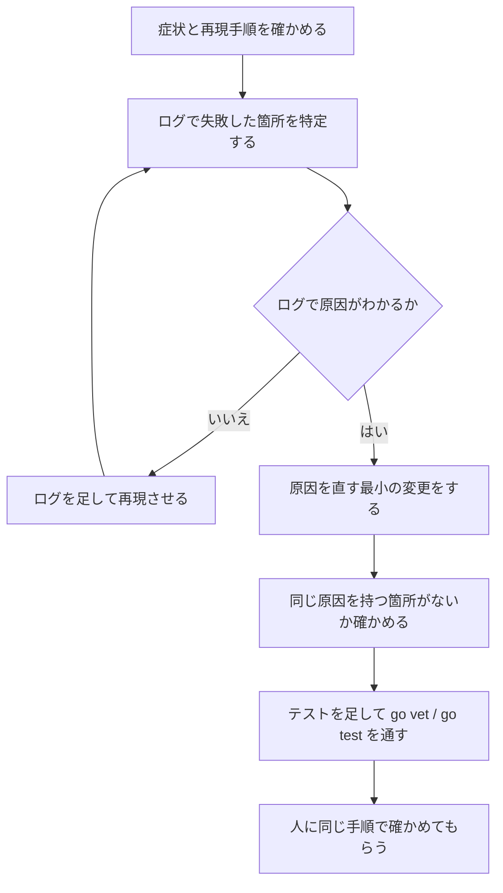

# 不具合の調査と修正

推測で直さず、ログなどの証拠から原因を確かめてから直す。症状を抑えるのではなく原因を直す。

## 手がかりになるもの

| 場所 | 内容 |
|---|---|
| `logs/server.log` | JSON 形式の動作ログ。`request.start` / `request.end`（`request_id`・`status`・`latency_ms`）、`agent.turn.start` / `agent.turn.end`（`turn_id`・`agent`・`session_id`・`model`・`error_code`・`latency_ms`）など |
| API のエラー応答 | `{"error_code", "message", "request_id"}`。`request_id` で `server.log` の該当リクエストを引ける（レスポンスヘッダー `X-Request-Id` にも入る） |
| `logs/chat-*.jsonl` | 会話履歴（1行1発言）。いつ誰が何を言ったか、システム通知が出たか |
| `logs/session.json` | 再起動時に引き継ぐ状態（作業ディレクトリ・各エージェントの CLI の会話ID・渡し済みの発言数） |
| CLI 出力の別窓 | 左ペインの「出力」で、エージェントの CLI の stdout / stderr をそのまま見られる |
| ブラウザの開発者ツール | 画面の不具合なら Console のエラーと Network の応答 |

## 進め方

1. **症状を確かめる**: 何をしたら、何が起きて、本来どうなるべきか。コードを読む前にここをはっきりさせる
2. **失敗した箇所を特定する**: どこで失敗しているかを、ログを引用して説明できるところまで絞り込む
   - API が失敗した → `request_id` で `server.log` を引く
   - エージェントが返事をしない・失敗する → `agent.turn.end` の `error_code` と CLI 出力の別窓
   - サーバーは正しいのに表示がおかしい → 画面（`src/web/`）の状態の更新や描画
3. **ログが足りなければ足す**: 原因がログから読み取れない場合は、先にログを足して再現させる。足したログは、次に同じ問題を調べるときにも役に立つので残す
4. **最小の変更で直す**: 原因に対する修正だけを行う。無関係なリファクタリングは混ぜない
5. **影響を確かめる**: 同じ関数や共通の処理を使う箇所に同じ問題がないかを見る。再発を防ぐテストを足す
6. **確認を頼む**: 原因（ログの該当行）と修正内容を伝え、同じ手順で直ったかを人に確かめてもらう

## 避けること

- ログや証拠を見ずに「たぶんこれ」で直す
- 原因がわからないまま null チェックやリトライを足して症状だけを消す
- `error_code` を確かめずにエラー処理を変える
