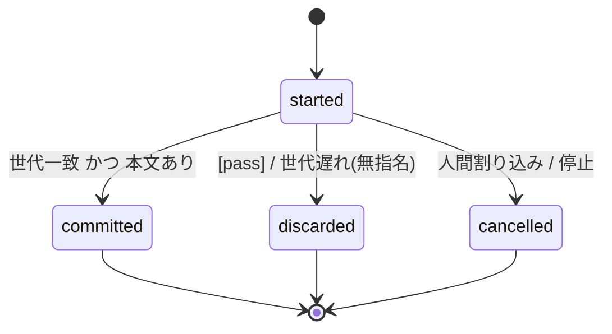
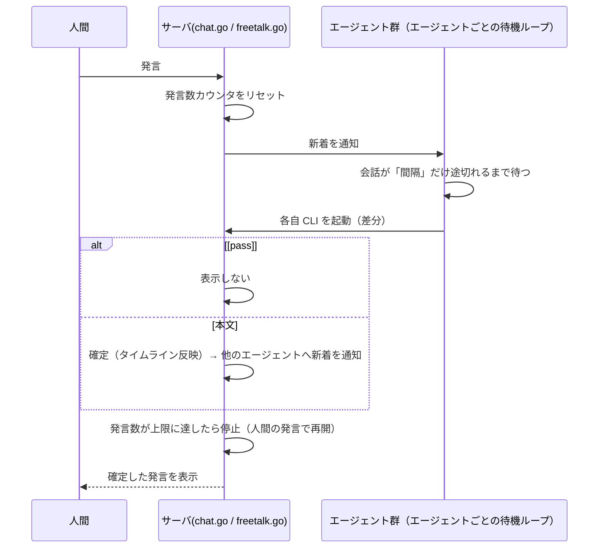

# グループチャット制御 仕様書

- ステータス: ドラフト（議論中）
- 対象: 人間と複数AIエージェント（@claude / @codex / @agy）のグループチャット
- 対象環境: Windows 10/11 デスクトップ（Go バックエンド + `web/index.html`）
- 編集ルール: 各エージェントは自分の順番で追記・編集する。変更は「13. 変更履歴」に記録する。
- 決定事項（2026-09-25 人間）: フリートークを採用する。会話中もエージェントのファイル書き込みを許可する。書き込みは全エージェントに許可し、編集者は必要に応じて相談して選ぶ。モデルの切替は、各エージェントが作業内容と自分の残りトークンを見て自己判断で行い、候補や予算の制限は設けない（全エージェントが有償プランのため）。

## 1. 目的

「1エージェントずつ順番に発言する」方式のテンポの悪さを解消し、人間と複数エージェントが相談しながら作業できるようにする。コスト・再現性・安全性は上限・停止・ログで管理する。

発言の進め方は次の3モードを用意する。

| モード | 発言者の決め方 | 主な用途 |
|---|---|---|
| チャット | 人間の宛先（宛先なし / `@all` は全員を並列起動）と、エージェントの `@ID` 指名 | 質問・作業依頼 |
| ディスカッション | 決まった順番で指定周回数 | 前の意見を踏まえた議論 |
| フリートーク | 全員が新着を見て、話したいときに発言（イベント駆動） | 自由な相談・雑談 |

画面は2ペインにする（2026-09-25 人間の依頼）。左ペインにエージェントの表示（モデル選択・状態・途中経過）、「設定」「停止」「新しい会話」「要約して新しい会話」「ログ」のボタン（左ペインの下に寄せる）、現在の作業ディレクトリを縦に並べ、右ペインにチャット（進行状況の帯・発言一覧・入力欄）を置く。幅600px以下では左ペインを上に置く。左ペインの「設定」ボタンで設定ダイアログを開き、間隔・上限・進め方・進行役・周回・作業ディレクトリはそこで変更する（2026-09-25 人間の依頼。操作ボタンと作業ディレクトリの表示だけを左ペインに置く）。画面の入力欄のボタンは「送信」1つにする（2026-09-25 人間の決定。以前の「開始」ボタンはまとめた）。フリートーク・ディスカッションの最中に送信すると、その会話への発言になる。会話が進んでいないときに送信すると、「設定」ダイアログの「進め方」で選んだ方法で始める。「フリートーク」（既定）と「順番に発言」（ディスカッション）は入力をお題にして始め、「チャット」は通常の発言になり、宛先（なければ全員）が返事をする。返事の中で別のエージェントが `@ID` で呼ばれると、呼ばれた側が続けて発言する（「上限」まで）。周回数の入力欄は「順番に発言」を選んだときだけ表示する。選択は画面内だけで保持し、サーバの API（`/api/discussions`・`/api/freetalk`）は変更しない（2026-09-25 人間の決定）。

「設定」ダイアログの設定（間隔・上限・進め方・進行役・周回）は、変更するとブラウザの Web ストレージ（localStorage の `ai_agent_room.settings`）に保存し、画面を開き直したときに復元する（2026-09-25 人間の依頼）。進め方・周回は画面だけの設定なので読み込み時に戻す。間隔・上限・進行役はサーバの設定でサーバの再起動により既定値に戻るため、接続（画面を開いたままサーバを再起動したときの再接続を含む）後に最初に届いた状態と保存値が違えば `PUT /api/settings` で送り直す。進行役は、そのエージェントが使えない場合は戻さない。

作業ディレクトリは「設定」ダイアログの欄で変更できる（2026-09-25 人間の依頼。`PUT /api/settings` の `workdir`）。存在するディレクトリでなければ 400 `INVALID_WORKDIR` を返し、ほかの設定も変えない。各 CLI の会話は作業ディレクトリに結び付くため、変更すると実行中の処理を止め、「新しい会話」と同じく履歴と各エージェントのセッションを破棄して始める（`room.workdir.set` をログに出す）。変更の前に、今の会話（チャットログのファイル名と各エージェントの会話ID・cursor）を `logs/workdirs.json` に作業ディレクトリごとに残し（最大30件、古いものから消す）、変更先に残っている会話があればそれを復元して続ける（案 10、`workdirs.go`。ログは `workdirs.archive`・`session.restore`）。一時停止の状態は変えない。変更後の作業ディレクトリは `logs/session.json` に残り、起動時に `-workdir` の指定がなければそれを使う（`start.bat` は引数がなければ `-workdir` を渡さない）。作業ディレクトリはサーバ側で引き継ぐので Web ストレージには保存しない。

「設定」ダイアログの「進行役」で、エージェントを1人進行役に指定できる（既定は「なし」。2026-09-25 人間の決定）。指定は `PUT /api/settings` の `leader` で行い、次の発言のプロンプトから反映する。プロンプトには毎ターン次の役割を書く。

| 対象 | プロンプトに書く役割 |
|---|---|
| 進行役 | 人間の依頼を作業に分けて `@ID` で割り振る。未完了の作業がある間は次の担当・作業・完了条件を示す。依頼の範囲内なら進めるかを自分で判断し、目的や範囲を変える判断が必要なときだけ人間に確認する。完了したら伝えて止まる |
| ほかのエージェント | 作業の割り振りと進めるかの判断は進行役に従う。割り振られた作業は確認を待たずに進め、結果を報告する |

指定の変更はシステムメッセージとしてチャットに残し、`room.leader.set` をログに出す。「新しい会話」では保持し、サーバの再起動で「なし」に戻る。参加できない（未インストールの）エージェントは指定できない。

行き違いを見分けるため、各発言に発言ID（#番号）を表示し、エージェントの返答には書き始めた時点で読んでいた最後の発言ID（`read_upto`、画面では「#N まで読了」）を付ける（2026-09-25 人間の依頼）。エージェントに渡す新着も「[#番号 名前（#N まで読了）]: 本文」の形式にし、返答より後に届いた修正報告などが反映されていないことを判断できるようにする。

人間は発言の「↩ 返信」から、特定の発言への返信として投稿できる（`POST /api/messages` の `reply_to`、案 8）。画面には返信先の先頭を添え、エージェントに渡す新着は「[#番号 human（#N への返信）]: 本文」の形式にする。

考え中のエージェントは、実行中のツール（途中経過）をエージェント名の横に「考え中 N秒 · ツール名: 詳細」と表示する（2026-09-25 人間の依頼。`progress.go`）。各 CLI の JSON ストリーム出力を1行ずつ読み、Claude Code は `--output-format stream-json --verbose` の `tool_use`、Codex CLI は `exec --json` の `item.started`（コマンド実行・MCP ツール・Web 検索・ファイル変更）、Antigravity は `--output-format stream-json` の `step_update`（`step_type: tool`、`state: ACTIVE`）から取り出す。詳細は1行60文字までに切り詰める。返答の本文・会話ID・使用量は従来どおりプロセス終了後に、Claude Code は最後の `type: result` 行、Antigravity は最後の `event: result` 行から読む。ターンが終わると途中経過の表示は消す。

「要約して新しい会話」ボタンで、長くなった会話を要約して新しい会話に引き継げる（2026-09-25 人間の依頼。`summary.go`、`POST /api/summarize`）。実行中の処理を止め、進行役（いなければ最初の参加可能なエージェント）が新しいセッションで会話の記録（パスを除く。20万文字を超える場合は新しい側から20万文字）を「決定事項・未完了の作業・注意点」にまとめる。要約ができたら「新しい会話」と同じく履歴と各エージェントのセッションを破棄し、要約を最初のシステムメッセージとして置く。元のログファイルは残す。要約は裏で作るので API は 202 を返し、作成中の再要求は 409 `SUMMARIZING`、発言がなければ 400 `NOTHING_TO_SUMMARIZE`。失敗したときは会話をそのまま残してシステムメッセージで知らせる。要約中に「新しい会話」などで会話が変わった場合は要約を捨てる。ログは `conversation.summarize.start` / `conversation.summarize.end`。要約のトークン使用量も担当エージェントの累計に含める。

同じ種類のエージェントを追加で登録できる（2026-09-25 人間の依頼。例: Codex の利用枠が尽きたときに Claude Code をもう1つ入れる。`agents.go`）。「設定」ダイアログの「エージェント」で種類（Claude Code / Codex CLI / Antigravity）を選んで追加すると、ID は「種類名+番号」（`claude2` など。種類ごとに既定を含めて5つまで）、表示名は「Claude Code 2」のようになり、`@claude2` で呼べる。種類名での呼びかけ（`@claude`）は既定のエージェントに届く。追加分は `logs/agents.json` に保存し、再起動後も参加する。追加したエージェントは削除でき、既定の3つは削除できない。追加・削除は、ディスカッション・フリートーク・発言待ち・考え中・要約中でないときだけ受け付ける（進行中は 409 `AGENTS_BUSY`）。削除したエージェントが進行役なら指定を解除する。API は `POST /api/agents`（`{"type": "claude"}`）と `DELETE /api/agents/{id}`。ログは `agents.add` / `agents.remove`。

エージェントを一時停止できる（2026-09-25 人間の依頼。`pause.go`）。左ペインのモデル選択の最後に「一時停止」があり、選ぶと一時停止、モデル（既定を含む）を選び直すと再開する（`PUT /api/agents/{id}` の `paused`）。一時停止中のエージェントは宛先・フリートーク・ディスカッション・進行役・要約の対象から外し、順番が回ってきても飛ばす。進行役だった場合は指定を外す。ターンが利用枠の上限エラー（`usage limit`・`rate limit reached`・`RESOURCE_EXHAUSTED` など）で失敗したら自動で一時停止にし、システムメッセージで知らせる（エラーコード `AGENT_QUOTA`）。判定には CLI がエラーとして返した部分（stderr、Claude Code の `is_error` の結果、Codex の `error` イベント、Antigravity の `error`）だけを使い、返答本文やツールの結果（stdout）は使わない。自動では戻さず、人間が手動で再開する。一時停止の状態は `logs/session.json` に保持し、会話の復元や作業ディレクトリに関係なく再起動後も引き継ぐ。ログは `agent.pause`（`by`: human / quota）・`agent.resume`。

人間が左ペインで選んだモデルは、設定（`settings-<ログディレクトリ>.json` の `agent_model`、エージェント ID ごと）に保存し、再起動後に戻す（2026-09-30 人間の依頼、強化案 2。`settings.go`）。既定のモデルに戻したら保存から消す。エージェントが `set_my_model` で自分で変えたモデルは保存せず、今までどおりその間だけ有効にする。起動時に、消えたエージェントの値や候補にないモデルは戻さず、Warn `settings.load.agent_model` を出す。戻したときはチャットにシステムメッセージを出さず、ログ `agent.model.set`（`by`: settings）だけを出す。追加したエージェントを削除したときは設定を保存し直し、そのエージェントのモデル・応答の上限を設定から消す（同じ ID で追加し直しても前の値を戻さない）。

CLI セッションを自動で切り替えてトークン消費を抑える（2026-09-25 人間の依頼。`rotate.go`）。人間が送信したとき（チャットの発言・ディスカッションやフリートークのお題を含む）、直近1回の実行の入力トークン（キャッシュ分を含む）がしきい値を超えたエージェントの CLI セッションを切り替える。今のセッションで使用量を一度も取得できていないエージェント（現状は Antigravity）は、そのセッションに渡した発言が150件を超えたら切り替える（2026-09-25 agy の指摘を受けて進行役が決定）。しきい値は「設定」ダイアログの「セッション切替」で変更でき、既定は50万トークン、0 で切り替えない（`PUT /api/settings` の `rotate_tokens`。画面の設定として Web ストレージにも保存する）。切り替えるときは、進行役（いなければ最初の参加可能なエージェント）が新しいセッションで会話の記録を「決定事項・未完了の作業・注意点」にまとめた議事録を1つ作り、`logs/minutes/minutes-<日時>.md` に保存して、切り替えるエージェント全員で使い回す。今の会話で前に作った議事録があれば、全文ではなく、前回の議事録とその後の発言（パスを除く）から差分で作る（2026-09-30 人間の依頼、強化案 10。`summary.go` の `minutesPromptLocked`）。このとき「決定事項」は前回の項目を省略せずに残し、新しい決定を追加する（取り消し・変更された項目も消さずに、その旨を書き添える）。前回の議事録がない（再起動の直後・「新しい会話」の後）、ファイルを読めない（Warn `minutes.delta`）、その後の発言がない場合は、会話全体から作る。「要約して新しい会話」の要約も同じ方法で作る。ログの `session.rotate.start`・`conversation.summarize.start` に `mode`（`delta` / `full`）を出す。対象のエージェントは次のターンの開始時に議事録の完成を待ち、新しいセッションで、議事録の絶対パスと、議事録を作った後の発言すべて（10件に満たなければ直近10件。自分の発言を含み、パスを除く）を受け取る。新着がないターンでは切り替えを確定せず、次に新着があるターンまで持ち越す。チャットの履歴は消さない。議事録の作成に失敗したときは切り替えずに会話を続け、システムメッセージで知らせる。直近の入力トークンとセッションの開始位置は `logs/session.json` の `last_input`・`session_start` に保持する。ログは `session.rotate.start`・`session.rotate.minutes`・`session.rotate`。

タブが背面にあるときにブラウザの通知で知らせられる（2026-09-30 人間の依頼、強化案 7。`web/index.html`）。設定ダイアログの「背面にあるとき通知する」をオンにしたときだけブラウザの許可を求め、設定は Web ストレージ（`ai_agent_room.settings` の `notify`）に保存する。タブが見えていないときに、エージェントの発言（「<名前> が発言しました」）、エージェントのエラー（システムメッセージの `[AGENT_…]` のコードだけ）、@human 宛ての未処理の増加（受信箱の件数）を通知する。発言の本文・作業フォルダ・コマンドの出力は通知に含めない。種類ごとに30秒は出し直さず、通知を押すとタブに戻る。接続時に読み込んだ発言では通知しない。

過去ログの一覧と検索は、ログが増えても重くならないようにしている（2026-09-30 人間の依頼、強化案 4。`logs.go`・`search.go`）。一覧の要約（期間・件数・題名）はファイルのサイズと更新時刻が変わらないあいだメモリ上に覚えておき、変わったログだけを読み直す（保存はしない。再起動後の最初の一覧では全ログを読む）。検索は上限（既定100件・最大500件）を超える一致を見つけた時点で残りのログを探さず、応答に `total_partial: true` を付ける（`total`・`logs` は探した範囲の数。画面は「N件以上」と表示する）。検索語に JSON で書き換わる文字（`"` `\` `<` `>` `&`・制御文字など）がなければ、行を JSON として解析する前に行のままで絞り込む。計測（1000ログ・301MB）では、2回目以降の一覧が 9.4秒から 4ms、よく出る語の検索が 4.2秒から 9ms、まれな語の検索が 4.4秒から 2.8秒になった。

過去の会話から分岐して新しい会話を始められる（2026-09-30 人間の依頼、強化案 3。`logs.go` の `BranchFromLog`、`POST /api/logs/{name}/branch`（`{"upto": 発言ID}`））。過去ログを表示しているとき、各発言の［ここから分岐］で確認のうえ、その発言までを引き継いだ新しい会話を始める。今の会話は「新しい会話」と同じく終わり（実行中の処理を止め、各エージェントのセッションを破棄し、新しいログファイルにする。今のログは残る）、引き継いだ発言は ID・返信先を変えずに新しいログファイルへ書き写す。元のログは読むだけで変更しない。引き継いだ発言のコードブロックは実行できない（復元と同じ）。最後にシステムメッセージで分岐元を知らせる。作業ディレクトリは今のものを使う。ログがなければ 404 `LOG_NOT_FOUND`、発言がなければ 400 `MESSAGE_NOT_FOUND` を返し、今の会話はリセットしない。各エージェントは次のターンで引き継いだ発言をすべて新着として受け取る。ログは `conversation.branch`。

発言のコードブロックの実行（`command.go`、`POST /api/messages/{id}/blocks/{n}/run`・`/cancel`）は、同時に3件まで実行できる（2026-09-30 人間の依頼、強化案 12。`commandMaxRunning`）。3件実行中のとき、または前の会話の同じブロック番号のコマンドがまだ動いているときは 409 `COMMAND_BUSY` を返す。中止は指定したブロック1件だけに効く。「新しい会話」では実行中のものをすべて止め、止めたものもプロセスが終わるまで3件の枠に数える。実行を始めたときは、システムの発言「▶ #N のブロック M を <シェル> で実行し始めました（作業フォルダ、時間制限）」を元の発言への返信として記録する（2026-09-30 人間の依頼、強化案 13）。この発言はエージェントのターンのきっかけにしない。実行結果（`command_result`）はこの開始の発言への返信にし、呼び出す相手は開始の発言の返信先（元の発言）から決める。

送信前の秘密情報の警告（2026-09-30 人間の依頼、強化案 1。`web/index.html` の `confirmSecrets`）。人間が送信するとき（チャット・順番に発言・フリートークのお題）、入力をブラウザ内で既知のキー形式（`sk-`、GitHub の `gh*_`・`github_pat_`、AWS の `AKIA`/`ASIA`、Slack の `xox*-`、Google の `AIza`、秘密鍵のヘッダ）と照合し、見つかったら確認ダイアログを出す。初期フォーカスは「戻って編集」で、「このまま送信」を選んだときだけ送信する。ダイアログにはキーの種類名だけを出し、見つけた値は画面にもログにも出さない。「ランダムに見える長い文字列」は誤検知を避けるため対象にしない。エージェントの返答や CLI 出力は対象外。

実行待ちのコマンドの一覧（2026-09-30 人間の依頼、強化案 11。`web/index.html` の `pendingCmdBoxes`・`renderPendingCmds`）。受信箱のパネルに「実行待ちのコマンド」の欄を置き、画面に［実行］ボタンがあって、まだ実行しておらず（サーバから実行状態が届いていない）、発言から1時間以内のブロックを発言の古い順に並べる。各行には発言者・ブロック番号・コードの最初の行・発言番号と時刻、［実行］を出し、コードを押すとそのブロックへ移る。［実行］はブロックの下の［実行］と同じ処理（`runCmd`。確認、保護パスの警告、期限切れはサーバも判定）を通す。受信箱の件数表示に「実行待ちのコマンド N件」を加え、@human 宛ての依頼がなくても実行待ちがあれば表示する。期限切れは1分ごとに見直す。サーバの API は変えない。

トークン使用量の画面表示（2026-09-30 人間の依頼、強化案 15。`chat.go` の `AgentStatus.Usage`・`LastInput`、`web/index.html` の `usageText`）。status イベントの各エージェントに、トークン使用量の累計（`logs/usage.json` と同じ値。実行の記録がなければ含めない）と直近1回の実行の入力を載せる。左ペインのエージェント欄に「直近 N · 累計 入力 N（キャッシュ N）/ 出力 N」を概数（k・M・B）で1行出し、ツールチップに正確な値・実行回数・更新時刻を出す。使用量を取得できなかった実行があれば「取得できず N回」を添え（累計には含めない）、すべて取得できなかった場合は「使用量: 不明」とする。金額と会話ごとの内訳（旧案 8.5）は出さない。

対話モードでの起動（2026-09-30 人間の依頼、強化案 9。`interactive.go`、`POST /api/agents/{id}/interactive`）。ログインや認証など非対話の実行では進められない操作のため、左ペインのエージェント欄の［対話］で、その CLI を新しいコンソール窓に対話モードで開く。画面の中に端末（PTY）は組み込まない。起動は `CreateProcess`（`CREATE_NEW_CONSOLE`、標準入出力のハンドルは渡さない。`proc_windows.go` の `startNewConsole`）で行い、作業フォルダは会話の作業ディレクトリ。引数は非対話用のもの（`-p`・`--output-format`・`exec`・`--json` など）を渡さず、権限・禁止ルール（Claude の `--settings`）・選択中のモデル・`CLAUDE_ARGS` / `CODEX_ARGS` / `AGY_ARGS` だけを引き継ぐ。AI Agent Room の MCP は渡さない。セッションがあれば同じセッションを再開し（Claude `--resume <ID>`、Codex `resume <ID>`、Antigravity `--conversation <ID>`）、なければ新しいセッションで起動して AI Agent Room の会話とは結び付けない。窓を開いている間はそのエージェントを会話に参加させず（`a.interactive`。一時停止とは別で保存しない。宛先・フリートーク・進行役・要約の対象から外す）、左ペインに「対話中」と出す。窓が閉じたら（プロセスの終了）会話に戻し、system の発言で知らせる。ログは `agent.interactive.start`（pid・session_id・linked）と `agent.interactive.end`（exit_code）。実行中（考え中）のエージェントと、すでに窓を開いているエージェントは 409 で断る。窓を表示できない環境（Windows サービスのセッション 0、Windows 以外）と対応していない CLI では［対話］を出さず（status の `interactive_ok`）、API も 409 `INTERACTIVE_UNSUPPORTED` で断る。AI Agent Room が終了しても窓はそのまま残る。AI Agent Room を再起動すると開いたままの窓は追跡しないため、同じセッションを二重に使わないよう、再起動の前に窓を閉じること。

macOS・Linux への試験的な対応（2026-10-01 人間の依頼。ビルド・`go vet`・単体テストのみ確認し、実機での確認はまだ。Linux の単体テストは WSL の Ubuntu で実行）。起動は `start.sh`（`start.bat` と同じく、Go があれば毎回ビルドし、前回のビルドより後に変わったファイルを表示して、端末から起動したときは続けるか確認する。`CODEX_ARGS=-c sandbox_mode=workspace-write` を設定する。LF 改行を `.gitattributes` で固定）。コードブロックの `cmd`・`bat`・`batch` は Windows 以外では実行できず、画面は［実行］を押せなくし（status の `os`）、実行待ちの一覧にも出さない。サーバも 400 `BLOCK_UNSUPPORTED_OS` で断る。対話モード（案9）は、macOS は `osascript` で Terminal.app を、Linux は `x-terminal-emulator`・`gnome-terminal`・`konsole`・`xfce4-terminal`・`xterm` の順に探した端末エミュレータを開く（Linux は `DISPLAY` か `WAYLAND_DISPLAY` がなければ使えない。`interactive_unix.go`）。端末アプリは CLI の終了を待たずに戻るため、作業フォルダに移って CLI を起動し、終わったら終了コードを目印のファイルに書く sh のスクリプト（一時フォルダ。引数は単一引用符で囲む）を開き、目印を1秒ごとに見て閉じたことを知る。窓を強制的に閉じた場合など目印が書かれないときのために、対話中は［対話］を［対話を終了］に替え（status の `interactive_manual`、`DELETE /api/agents/{id}/interactive`）、押すと会話に戻す（窓は閉じないため、開いていれば人間が閉じる。ログ `agent.interactive.stop`）。Windows は窓が閉じたことを自動で検知できるため［対話を終了］は出さず、API も 409 `INTERACTIVE_AUTO` で断る。プロセスの終了は、Windows 以外では CLI・コードブロック・利用枠の取得・診断で起動するプロセスを新しいプロセスグループ（`Setpgid`）で起動し、中止・時間切れのときはグループごと `SIGKILL` で終了させる（`proc_other.go` の `newProcessGroup`・`killTree`。Windows は従来どおり `taskkill /T /F`）。これにより、CLI やスクリプトが起動した孫プロセスが残らず、出力をつかんだ孫プロセスの終了を待って戻りが遅れることもない（WSL の Ubuntu で確認）。

エージェントの権限の段階（2026-09-30 人間の依頼、強化案 8。`permission.go`、`PUT /api/agents/{id}` の `permission`）。設定ダイアログのエージェント一覧で、エージェントごとに「既定（起動時の設定のまま）」「読み取りのみ」「作業フォルダに書き込み可」を選ぶ。「制限なし」は、他のエージェントの発言に影響されて危険な操作をするおそれがあるため用意しない。初期値は既定で、今までどおり CLI の設定と `*_ARGS` のまま動く。引数への変換は、Claude が読み取りのみ `--disallowedTools=Edit,Write,NotebookEdit,Bash,PowerShell` と `--strict-mcp-config`（利用者側の MCP、たとえば termio からもシェルを操作できるため、AI Agent Room が渡す MCP の設定だけを使わせる）・書き込み可 `--permission-mode acceptEdits`、Codex が `-c sandbox_mode="read-only"` / `"workspace-write"`（`codex exec resume` が `-s` を受け付けないため設定の上書きで指定）。Codex のサンドボックスは MCP サーバの側には効かないため、制限できるのはファイルの書き込みだけで、画面にも「ファイルの書き込みだけを制限します（MCP ツールは制限されません）」と注記する。Antigravity は指定方法を確かめていないため非対応と表示する。守るファイルへの禁止ルール（Claude の `--settings` の deny）は段階にかかわらず外さない。既定以外を選んだときは画面の選択を優先し、`*_ARGS` の権限のオプション（Claude `--permission-mode`・`--dangerously-skip-permissions`、Codex `-s`/`--sandbox`・`-c sandbox_mode=…`/`sandbox_permissions=…`・`--full-auto`・`--dangerously-bypass-approvals-and-sandbox`）を外して Warn `agent.permission.override` を出し、画面にも「起動時の指定（*_ARGS）を上書きしています」と出す（status の `permission_override`）。段階は非対話の実行と対話モード（案9）の両方に反映し、次の発言から効く。権限を上げる操作（書き込み可を選ぶ、読み取りのみから外す）は画面で確認を出す。変更はログ `agent.permission.set`（from・to・by）とチャットの system の発言に残す。保存先は設定フォルダの設定ファイル（`agent_permission`。既定は入れない）で、エージェントからは書き換えられない場所に置く。変更はトークン認証された画面の API からだけで、エージェント向けの MCP ツールは用意しない。起動時に戻すとき、消えたエージェントや選べない段階は戻さず Warn `settings.load.agent_permission` を出す。

エージェントの返答は、書き終わる前から画面に仮の吹き出しで表示する（2026-09-30 人間の依頼、強化案 5。`partial.go`）。Claude Code は `--include-partial-messages` の本文の断片（`text_delta`）を積み上げて表示し、次のメッセージ（`message_start`、ツール呼び出しの後など）で表示し直す。thinking とサブエージェント（`parent_tool_use_id` あり）の本文は使わない。Codex は本文を少しずつは出さないので、返答（`agent_message`）が1件届くたびに表示する。Antigravity は未確認のため対象外。書きかけの本文はイベント `partial`（`{agent, text}`。0.3秒に間引く）で画面にだけ配信し、会話・チャットログ・セッション・他のエージェントへの新着には入れない。ジョブ用トークンは伏せる。仮の吹き出しは薄く表示して「書いています…」を添え、本文は整形しない（先頭の `[pass]` は隠す）。返信・実行・受信箱の対象にしない。確定した発言が届いたとき、ターンが終わったとき（成功・失敗・中止のどれでも空の `partial` を配信する）、「新しい会話」で消す。Claude の書きかけの本文の行（`stream_event`）は CLI 出力の別窓には流さない。

エージェントの CLI 出力を別窓でストリーミング表示できる（2026-09-25 人間の依頼。`livelog.go`・`web/live.html`）。左ペインの各エージェントの「出力」ボタンで別窓を開くと、そのエージェントのターン中の stdout / stderr が1行ずつ流れる（ターンの開始・終了・失敗も1行で示す）。サーバはエージェントごとに直近1000行だけをメモリに保持し（1行2000文字まで、ファイルには保存しない）、別窓は開いている間だけ `GET /api/agents/{id}/live`（SSE）に接続して、最初に保持分を受け取る。別窓は最新行への追従（上へスクロールすると止まる）と表示の消去ができ、表示は3000行まで。

設定ダイアログの［診断］で、各エージェントの CLI を確認できる（2026-09-30 人間の依頼、強化案 6。`diag.go`、`POST /api/diag`）。押したときだけ、全エージェントの CLI を並行して `--version` で起動し（Codex は node で JS エントリを起動する場合も同じ引数）、結果を「取得できた（出力の最初の行をバージョンとして表示）・見つからない（実行ファイルがない）・起動に失敗した（起動エラーまたは終了コードが 0 以外。エラー出力の最初の行を添える）・時間切れ（5秒）」で返す。起動時には自動で実行しない。起動は CLI の実行と同じ `runProcess` を使い、窓を出さず、時間切れならプロセスツリーごと終了させる。ログは `diag`（エージェントごと）。

画面の smoke test は `ui_smoke_test.go` と `development/ui-smoke.mjs` にあり、`AI_AGENT_ROOM_LIVE=1 go test -run TestUISmoke -v` で実行する。Node.js と Edge が必要で、2ペインのチャット、設定ダイアログ、CLI 出力の別窓を確認し、スクリーンショットを保存する。Edge のパスは `AI_AGENT_ROOM_EDGE`、成果物の保存先は `AI_AGENT_ROOM_UI_ARTIFACT_DIR` で指定できる。

サーバを再起動すると、前回の会話を復元して続きから話せる（2026-09-25 人間の依頼）。`logs/session.json` に現在のチャットログのファイル名・作業ディレクトリ・各エージェントの CLI の会話IDと渡し済みの発言数（cursor）を保持し、起動時にチャットログを読み込んで同じファイルへ追記を続ける。保存は起動時・ターンの完了時・「新しい会話」のとき。「新しい会話」のログファイル名は、現在のファイルか既存のファイルと重なる場合に1秒ずつずらして別のファイルにする。作業ディレクトリが前回と異なる場合は、前回の会話を `logs/workdirs.json` にそのディレクトリの会話として残し、起動した作業ディレクトリに残っている会話があればそれを復元する（CLI の会話が作業ディレクトリに結び付くため。パスの大文字・小文字は区別しない）。実行中だったターン・ディスカッション・フリートークは再開せず、進行役などの設定も復元しない。復元の結果は `session.restore` をログに出す（`session.json` がないときは Info、読めないときは Warn）。`session.json` と `usage.json` は一時ファイルに書いてから置き換え、Dropbox の同期などで置き換えが権限エラー（Access is denied）になったときは 50ms 間隔で最大5回まで試す（`statefile.go`）。

名前は AI Agent Room（2026-10-01 人間の決定。旧名 AI Chat）。実行ファイルは `ai-agent-room.exe`、設定フォルダは `%LOCALAPPDATA%\ai-agent-room`（macOS・Linux は OS の設定フォルダの下の `ai-agent-room`）、環境変数は `AI_AGENT_ROOM_*`、Web ストレージのキーは `ai_agent_room.*`、MCP サーバ名は `ai_agent_room`。旧名からの引き継ぎとして、起動時に新しい設定フォルダがなく旧いフォルダ（`ai_chat`）があればフォルダごと移し（ログ `config.migrate`。`AI_AGENT_ROOM_CONFIG_DIR` を指定しているときは移さない）、画面は旧いキー（`ai_chat.settings`・`ai_chat.human`）の値を新しいキーに写して旧いキーを消す（`theme.js`）。旧い環境変数（`AI_CHAT_*`）は読まない。

「上限」（人間の発言1回あたりのエージェントの発言数。`max_hops`・`-max-hops`）の既定値は 100。0 を指定すると無制限で、上限による停止をしない（2026-10-01 人間の決定。`chat.go` の `hopLimitReached`）。負の値は 1 にする。
言語の設定（2026-10-02 人間の依頼。`settings.go` の `SetLang`、`envprofile.go`、`PUT /api/settings` の `lang`）。設定ダイアログの「言語」は画面の表示言語に加えて、起動時と新しい会話の開始時に投稿する「環境とこの会話でのルール」の言語も決める。英語なら見出し・環境・エージェントのできること・既定のルールを英語で投稿する（ルールは設定フォルダの `rules.en.md` を優先し、なければ `rules.md`、どちらもなければ既定の英語のルール。人間が書いた `rules.md` は言語の設定で無視しない）。設定はサーバの設定ファイルに保存し、status の `lang` で画面に伝える（画面はこれに合わせて表示言語を切り替える。サーバに設定がなければ、そのブラウザで選んでいた言語を送る）。変えても今の会話の投稿は書き直さず、次の投稿から反映する。それ以外のエージェントへの指示とシステムメッセージは日本語のまま。

## 2. 設計方針

| 項目 | 方針 |
|---|---|
| 発言方式 | イベント駆動。新着ごとに対象エージェントへ配信し、返答は任意（`[pass]` で見送り） |
| 常駐プロセス | 使用しない（呼び出しごとに CLI を起動）。フリートークの「常時待機」はサーバ内の待機ループで実現する |
| 書き込み権限 | 会話中も書き込み可（人間の決定）。権限は各 CLI の設定に従う |
| 安全性 | 暴走防止の上限、人間割り込み、停止、世代管理を必須とする |

### フリートークのリスクと対策

旧版では次の理由で常時フリートークを不採用としていたが、人間の決定により採用し、対策で補う。

| リスク | 対策 |
|---|---|
| 発言のたびに他エージェントが起動し、コストが掛け算で増える | 人間の発言1回あたりのエージェント発言数に上限を設ける。見送りは表示しない |
| エージェント同士の反応連鎖で止まらない | 上限到達で停止し、人間の発言で再開する。全員が見送れば自然に静止する |
| 作業ディレクトリでの同時編集の衝突 | 当面は運用で回避する（作業依頼は1人を指名する）。仕組みでの排他は「12. 未決事項」 |

## 3. メッセージ配信

- 全発言を追記型ログ（JSONL）に記録する。
- 各エージェントには、最終既読位置以降の差分のみを渡す。
  - 既読位置は、ジョブ完了時の最新位置ではなく、起動時に実際に渡した末尾まで進める。作業中に届いた発言は次回に渡す（読み飛ばし防止。@codex）。失敗時は既読位置を進めない。現行実装（`chat.go` の `runTurn`: 起動時の `upto` で `cursor` を更新）はこの動作になっている。
- 短時間（数秒）のデバウンスで新着をまとめて渡す。
- 優先度: 人間の発言 > `@ID` 指名 > 未回答の質問 > 無指名。

## 4. 発言制御

- 返答の先頭が `[pass]` の場合は発言なしとして扱う。判定用の別呼び出しは行わない（Claim方式は不採用。CLI起動コストが二重にかかるため）。
- `@ID` 指名されたエージェントは必ず反応する。無指名は自由参加。
- 無指名メッセージには、話題に最も合致するエージェントをファーストレスポンダーとして優先する。
- エージェント同士の連続発言に上限を設ける。1周で全員が `[pass]` した場合は静止する。

## 5. 並列生成とストリーミング

- 対象エージェントを並列起動し、出力をストリーミングで受信する。
- 先頭が `[pass]` なら即破棄する。本文なら到着順に確定する。
- フロントには、エージェントごとのストリームIDで受信枠を分けて表示する。確定した発言のみメインのタイムラインに反映する。

## 6. 世代管理（スナップショット）

- 各生成ジョブに、開始時点のログ世代番号を付与する。
- 完了時に世代が進んでいた場合の扱い:
  - 無指名: 破棄（実質 `[pass]`）
  - `@ID` 指名: 最新差分を添えて1回だけ再生成
- フリートークでは、応答の遅いエージェントの返答が破棄され続けて発言できなくなるおそれがあるため、適用方法を検討する（「12. 未決事項」）。
  - 提案（@claude）: フリートークでは世代を「人間の発言」でのみ進める。エージェントの発言で世代は進めず、遅れて完了した返答も確定する（エージェント同士の話題のずれは許容する）。人間の発言で世代が進んだ場合の扱いは、書き込み中の強制終了を避けるため第12章の @codex 案と合わせて決める。
  - 代案（@codex）: 用途の異なる2つの番号に分ける。人間の発言でも旧応答は破棄しない（実行済みの編集の完了報告が失われるため）。
    - メッセージ番号: 発言ごとに進む。差分配信（既読位置）にのみ使い、破棄の判定には使わない。
    - 無効化用世代: 「停止」と「新しい会話」でのみ進む。完了時に世代が進んでいたジョブの応答は破棄する。
    - 応答を無効化するだけでは旧ジョブの編集が続くため、無効化用世代を進めるときは第7章の統一案に従い旧ジョブのプロセスも終了させる。

## 7. キャンセル

- 人間が発言した時点で、生成中の全ジョブをキャンセルする。
  - 統一案（@codex、第6章の代案と対応。人間の決定待ち）: キャンセルの契機を「停止」と「新しい会話」の2つに限り、人間の通常の発言ではキャンセルしない。
    - 「新しい会話」では、無効化用世代を進めてから旧ジョブのプロセスツリーを終了させる。新しい会話のジョブは、旧プロセスの終了を確認してから開始する（旧ジョブの編集と重ならないようにするため）。
    - 終了を確認できない場合は、新しいジョブを待機させ、ログに記録して人間に表示する。
- プロセス管理はエージェント単位ではなくジョブ単位のIDで行う。
- Windows では SIGINT が使えないため、`adapters.go` の `killTree`（`taskkill /T /F`）でプロセスツリーごと終了する。
  停止後に子プロセスが残らないことは確認済み。CPU・トークン消費の計測は未実施。

## 8. 権限と作業

- 会話中もエージェントのファイル書き込みを許可する（2026-09-25 人間の決定。旧版の「会話モード＝Read-Only / 作業モード分離」は廃止）。
- 権限は各 CLI の設定に従う。AI Agent Room 側で追加の引数を渡す場合は環境変数 `CLAUDE_ARGS` / `CODEX_ARGS` / `AGY_ARGS` を使う。
  - 2026-09-25 時点の設定: Claude Code は `defaultMode: "auto"`、Codex CLI は信頼済みプロジェクト + `sandbox = "elevated"`、Antigravity は書き込み実績あり
  - 上記は設定値であり、実行時の有効権限とは一致しない場合がある（2026-09-25、Codex CLI のセッションは実行時に読み取り専用だった）。書き込めるかどうかは実行時の有効権限で判断する。
- 書き込みは全エージェントに許可する。編集担当の固定や、ほかのエージェントを読み取り専用で起動する仕組みは設けない（2026-09-25 人間の決定。ディスカッション等で相談しながら作業できるようにするため）。
- 同時編集の衝突は運用で避ける。同じファイルを編集する必要があるときは、会話の中で相談して編集者を決める（例: 「このファイルは私が編集します」と宣言する）。別のファイルの作業は並行して進めてよい。全ジョブを直列化するロックは、相談の並列性を損なうため導入しない（@codex / @agy）。
- 実行時の設定（サンドボックス、承認モード等）によっては、会話中でも書き込めない場合がある。書き込めなかったエージェントは、その旨を発言で明示し、書き込み可能なエージェントに依頼する。

## 9. ログ仕様

- 会話ログ: 確定した発言を JSONL（`logs/chat-*.jsonl`）に記録する。1行1発言で、時刻・発言者・発言したモデル・本文を含む。
- ジョブログ: 途中生成を発言として保存せず、ジョブ単位の状態イベントを JSONL に記録する。

状態: `started` / `cancelled` / `discarded` / `committed`

## 10. 処理フロー（フリートーク）

## 11. 実装状況

2026-09-25 時点。✅ 実装済み / ⚠️ 一部 / ❌ 未実装

| 章 | 項目 | 状況 | 現在の実装 |
|---|---|---|---|
| 1 | 3モード（チャット / ディスカッション / フリートーク） | ✅ | |
| 3 | JSONL 記録・差分配信 | ✅ | |
| 3 | デバウンス | ⚠️ | 「間隔」（既定3秒）。フリートークとエージェント同士のターン間で適用。人間の発言直後は待たない（チャット） |
| 3 | 優先度 | ❌ | |
| 4 | `[pass]` 判定 | ⚠️ | 返答全体が `[pass]` のときのみ（先頭判定ではない） |
| 4 | 指名は必ず反応 | ⚠️ | チャットでは起動するがパス可。フリートークでは指名を特別扱いしない |
| 4 | ファーストレスポンダー | ❌ | 全員並列 |
| 4 | 連続発言の上限・全員パスで静止 | ✅ | チャット: ターン数、ディスカッション: 周回数、フリートーク: 発言数 |
| 5 | 並列起動 | ✅ | チャットの宛先なし / `@all`、フリートーク |
| 5 | ストリーミング・先頭 `[pass]` の早期破棄・受信枠 | ❌ | 完了後に一括受信 |
| 6 | 世代による破棄・再生成 | ❌ | 世代番号は「新しい会話」でのみ使用 |
| 7 | 人間発言で全ジョブキャンセル | ❌ | 「停止」ボタンでのみキャンセル |
| 7 | プロセスツリー終了 | ✅ | |
| 8 | 会話中の書き込み許可 | ✅ | 各 CLI の設定による |
| 9 | 会話ログ（時刻・発言者・モデル） | ✅ | |
| 9 | ジョブログ（状態イベント） | ⚠️ | `logs/server.log` に `agent.turn.start` / `agent.turn.end`（error_code 付き）。状態名は仕様と異なる |
| 12 | 自己管理: トークン使用量の集計・保持 | ⚠️ | ジョブ単位で集計し `logs/usage.json`（エージェントごとの累計・未取得ジョブ数・更新時刻）と `agent.turn.end` ログ（`usage_known` / `input_tokens` / `cached_input_tokens` / `output_tokens`）に記録。Claude Code・Codex CLI は実機で取得を確認、Antigravity は「不明」 |
| 12 | 自己管理: プランの残り利用枠の取得・保持 | ⚠️ | `quota.go`。Claude Code は `claude -p "/cost"`、Codex CLI は `codex app-server` の `account/rateLimits/read`、Antigravity は `agy -p "/credits"`（クレジット残高のみ）で取得（第12章「利用枠の取得方法」）。起動時・10分ごと・ジョブ終了時（前回の試行から60秒以内は省略）に更新し、`logs/usage.json` の `quotas` に取得日時・取得元・失敗理由とともに保持。失敗しても前回値は消さない。3つの CLI とも実機で取得を確認（`AI_AGENT_ROOM_LIVE=1 go test -run TestLiveQuota`）。AI Agent Room 本体からの取得は本体再起動後の確認待ち |
| 12 | 自己管理: 利用状況・モデル候補のプロンプト提示 | ⚠️ | 毎ターン、累積消費・プランの残り利用枠（取得できない場合は「不明」）・使用中のモデル・候補一覧（取得元付き）を添える。画面ではエージェントのチップのツールチップに利用枠を表示する。コンテキスト残容量は未実装 |
| 12 | 自己管理: エージェントによるモデル切替（専用ツール） | ⚠️ | `mcp.go`。固定エンドポイント `POST /mcp` の `set_my_model(token, model)`。ジョブ用トークン（ジョブ終了で失効）・世代・設定の版番号・候補の検証あり。Claude Code（`--mcp-config` / `--allowedTools`）と Codex CLI（`-c mcp_servers.ai_agent_room...`、ツール単位で `approval_mode="approve"`）は実機で切替を確認。Antigravity は設定登録の了承待ちで未接続（SSE 対応が必要な見込み）。切替失敗時の復帰（直前の成功モデルで再実行）は未実装 |
| 1 | 再起動時の会話の復元 | ✅ | `session.go`。`logs/session.json` から履歴・CLI の会話ID・cursor を復元 |
| 8 | 編集者の選定 | ✅ | 仕組みは設けず、会話の中で相談して選ぶ運用（人間の決定） |
| 1 | 画面の自動 smoke test（案 11） | ✅ | `ui_smoke_test.go`・`development/ui-smoke.mjs`。`AI_AGENT_ROOM_LIVE=1` のとき Edge でチャット・設定・別窓を確認し、スクリーンショットと JavaScript エラーを検査 |

## 12. 未決事項

- [x] 各CLI（Claude Code / Codex / Antigravity）の Read-Only 権限の指定方針 → 会話中も書き込み可に変更（第8章）
- [x] 常時フリートークの採否 → 採用（2026-09-25 人間の決定）
- [x] 同時編集の衝突回避 → 会話で調整する運用に決定（2026-09-25 人間の決定。第8章）。全員に書き込みを許可し、編集者は必要に応じて相談して選ぶ。仕組みによる排他は設けないため、同時編集が起きないことは保証されない。
  - 不採用とした案（記録）: 編集担当を1人に固定し、ほかを読み取り専用で起動する案（@claude / @agy）、書き込み可能なジョブのロック（@codex）、読み取り専用に制限できない CLI の扱い（案A / 案B）。
- [ ] フリートークでの世代管理（第6章）と人間発言キャンセル（第7章）の適用方法
  - 検討案（@codex）: 書き込み許可（第8章）と両立させるため、人間の通常の発言では生成中のジョブをキャンセルせず、新着として次回に配信する。キャンセルは「停止」の明示操作のみとする。応答を破棄してもファイル変更は巻き戻せないため、書き込みを伴うジョブの破棄は変更が残る前提で扱う
- [ ] ファーストレスポンダーの選定ロジック（直近発言者優先 > 専門性キーワード > ラウンドロビンの優先順位で検討）
- [ ] デバウンス時間の既定値（1.5秒〜2.0秒を初期値の候補とする。現行実装は3秒）
- [ ] Windows でのプロセスツリー終了時の CPU・トークン消費の計測
- [ ] エージェントの自己管理（モデル切替・トークン使用量の確認）（2026-09-25 人間の要望）
  - 現状: モデル切替は画面から人間が行う（`chat.go` の `SetAgentModel`。次の発言から反映し、システムメッセージで通知、`agent.model.set` をログ記録）。トークン使用量は Claude の `modelUsage` を実際に使われたモデル名の判定にのみ使い、記録・表示はしていない。
  - 検討案（@claude / @codex / @agy）:
    - 許可範囲（2026-09-25 人間の決定）: モデルの候補や予算の制限は設けない。各エージェントが作業内容と自分の残りトークンを見て自己判断で切り替える（全エージェントが有償プランのため）。サーバの検証は、そのCLIで使えるモデルか（各 CLI のモデル一覧・`modelIDRe`）の入力チェックのみとする。
      - 不採用（記録）: 人間が許可したモデル候補の範囲に限る案、任意設定の予算（@codex）。
    - 切替の結果（@codex）: 要求したモデルと実際に使われたモデルを分けて記録・表示する（現行実装も `AgentStatus` の `ModelSel`（選択）と `Model`（実際）を分けて持つ）。
      - 切替に失敗した場合（CLI がエラーを返す、または実際のモデルが要求と異なる）は、次のプロンプトでそのエージェントに通知し、自己判断で選び直せるようにする。失敗は `agent.turn.end` のログにも残す。
      - 切替先のモデルで起動できない場合（@codex）: そのモデルのままでは失敗通知を読めないため、直前に成功したモデルに戻して一度だけ再実行し、失敗の内容を添えて選び直させる。それも失敗した場合は、画面に通知してそのエージェントを待機させる（人間の操作を待つ）。復帰と待機はシステムメッセージとログに残す。
        - 自動再実行の条件（@codex）: モデルが利用できず、作業開始前に失敗したと確認できる場合（例: CLI がモデル不明・利用不可のエラーを返して即終了）に限る。編集後の通信切断など、作業がどこまで進んだか不明な失敗では二重実行になり得るため、自動再実行せず、状況を通知して待機する。
        - 「直前に成功したモデル」の記録（@claude / @codex）: 成功したジョブの起動時に CLI へ渡したモデル指定の値（起動時の `modelSel`）をエージェントごとに保存する。完了時点の `modelSel`（実行中に変更され得る）や、CLI が報告する実際のモデル名 `Agent.model`（`--model` に渡せるとは限らず、報告がなければ空）は使わない。
        - 作業開始前の失敗の判別材料: CLI ごとに、モデル不明・利用枠超過で起動直後に終了するエラーパターンを実装時に整理する。Antigravity は存在しないモデル名で `404`、利用枠超過で `429 RESOURCE_EXHAUSTED` を返して即時終了する（@agy。未実測）。
        - ただし、エラーコード（`404` / `429` 等）だけでは作業開始前に失敗した証拠にならない（@codex）。自動再実行には、最初のモデル呼び出しで失敗したと確認できる情報（例: ツール実行・ファイル変更のイベントが一度も出ていない）も必要とし、判別できない場合は自動再実行せず、通知して待機する。
    - 変更要求の受け渡し: 本文中の制御タグは引用・コード例と誤認されるおそれがあるため、通常の発言とは別の構造化データで返す（@codex）。サーバが検証（各 CLI のモデル一覧・`modelIDRe`）して次の発言から適用し、システムメッセージと `agent.model.set` ログに残す。
      - 実現方法は要検討。候補: (1) AI Agent Room が専用ツール（MCP。例: `set_my_model`）を提供する、(2) 応答全体を JSON にし、本文と制御要求を別のフィールドに分ける（CLI ごとに構造化出力の指定方法が異なるため要調査）。
      - 専用ツールを本命とする（@claude / @agy。3つの CLI で共通に使え、本文との誤認がない）。ただし、モデルが誤ってツールを呼ぶ可能性は残るため、サーバ側で変更先（そのCLIで使えるモデルか）・呼び出し元・設定の版番号を必ず検証する（@codex）。
      - 導入時の確認項目: 3つの CLI から AI Agent Room の MCP サーバに実際に接続し、ツールを呼べること（@codex）。
      - 実装順（@codex）: MCP サーバを作る前に、各 CLI の MCP 接続方式と、ジョブ単位の識別情報（ジョブ用トークン）の渡し方を確認する（手戻り防止）。
        - 確認結果（2026-09-25 @claude / @agy。各 CLI の `--help` で確認、接続の実測は未実施）:
          - Claude Code: 起動時に `--mcp-config` で JSON 文字列を渡せる。ツールの実行許可は `--allowedTools mcp__ai_agent_room__set_my_model` で与える想定。
          - Codex CLI: 起動時に `-c mcp_servers.ai_agent_room.url="..."` で設定を上書きできる（streamable HTTP 対応）。非対話実行でのツール承認の扱いは要確認。
          - Antigravity: 起動時に指定するフラグはない。設定ファイル（`~/.gemini/config/mcp_config.json` 等。HTTP は `serverUrl`）または `agy mcp add` で恒久的に登録する（@agy）。登録はユーザーの設定を書き換えるため、実行前に人間の了承を得る。
            - 接続は未確認（@codex）: Antigravity のリモート MCP は SSE 形式（GET でのイベント購読＋POST）を前提としている（@agy）。AI Agent Room の実装は streamable HTTP の JSON 応答のみで、`GET /mcp` は 405 を返すため、そのままでは接続できない可能性が高い。接続確認で非対応なら、SSE トランスポートを追加するか、接続用の中継を使う。
        - 方式（@codex 案を採用）: 接続先は全 CLI 共通の固定エンドポイント（例: `/mcp`。`127.0.0.1` のみ）とし、ジョブ用トークンは起動ごとに依頼文で渡して、変更ツールの必須引数とする。
          - 採用理由: Antigravity は起動ごとに接続先を変えられない。また固定の合言葉だけでは、旧ジョブの遅れた要求が次のジョブの実行中に届いた場合に区別できない（@codex）。トークンを引数にすれば全 CLI で同じ仕組みになる。
          - 不採用: URL にトークンを含める方式（`/mcp/<トークン>`）。アクセスログや CLI のエラー出力に URL が残るおそれがあり、Antigravity で使えないため。
          - トークンの秘匿（@codex）: トークンはログ・チャットログ・画面に出さない（ツールの引数を記録する場合は伏せる）。
          - 接続確認の項目（@codex）: ジョブ終了後のトークンでの変更要求が拒否されること。
      - 要求の受付条件（@codex）: 「無効化用世代（第6章）がジョブ起動時と一致する」かつ「呼び出し元のジョブが有効（終了していない）」の両方を満たす場合のみ受け付ける。満たさない要求は拒否してログに記録する。
        - ジョブの終了はそのジョブだけを無効にし、無効化用世代は進めない（ほかの実行中ジョブを巻き込まない）。
        - 「停止」「新しい会話」は無効化用世代を進め、その時点の全ジョブからの要求を無効にする。
      - 専用ツールの条件（@codex）:
        - 呼び出し元のエージェントはサーバ側で識別する（例: ジョブごとに発行したトークン）。引数での自己申告は信用しない。変更できるのは自分の次回のモデルだけとする。
        - モデル設定に版番号を持たせ、ジョブ起動時の版番号を要求に添えて照合する。ジョブ実行中に人間がモデルを変更して版番号が進んでいた場合は、古いジョブからの変更要求を拒否し、ログに記録する（人間の設定を上書きしない）。
      - 不採用: 本文の末尾に JSON を書く方式は、本文中の制御タグと同じく引用・コード例と誤認するおそれがあるため、自動適用には使わない（@codex）。
    - 取得と保持（2026-09-25 人間の提案）: 利用状況（使用量・プランの残り利用枠）と利用できるモデル一覧は、エージェントが都度取得するのではなく、AI Agent Room がまとめて取得して保持する。エージェントには保持している値（モデル一覧を含む）をプロンプトで渡す。
      - 保持形式（@codex）: 専用ファイルに最新状態を保持し、各値に取得日時・取得元（CLI・コマンド/ファイル）・取得結果（成功/失敗）を添える。
      - 更新契機（@codex）: 起動時・定期更新・モデル切替の失敗時（使用量はジョブ終了時にも更新）。
      - 取得失敗時（@codex）: 前回値を消さず「古い情報」として残し、取得日時とともに表示する。前回値もなければ「不明」とする。
      - 使用量: ジョブ終了時に取得し、ログ（`agent.turn.end`）と専用ファイル（例: `logs/usage.json`。エージェントごとの累計・取得時刻）に保持する。
      - プランの残り利用枠: 取得手段のある CLI（Claude Code・Codex CLI・Antigravity。取得できる内容は CLI ごとに異なる。下の「利用枠の取得方法」）について、AI Agent Room が起動時・定期的・ジョブ終了時に取得し、取得時刻とともに同じファイルに保持する。古い値であることが分かるよう、取得時刻も表示する（実装済み）。
      - モデルの候補一覧（@codex）: 「利用できるモデル一覧」ではなく「候補一覧」と呼ぶ。現在のアカウントで利用できると確認済みとは限らないため、取得元の種類（固定定義 / キャッシュ / CLI 照会）を記録し、プロンプトでもその区別を伝える。現行の取得元: Claude Code は固定定義、Codex CLI はキャッシュ、Antigravity は CLI 照会。
      - 候補一覧の用途: 切替の検証と、エージェントが選ぶ候補の提示に使うため、事前に取得して保持する。現行実装は起動時に取得済み（Claude Code: 固定の別名 `opus` / `sonnet` / `haiku` / `fable`、Codex CLI: `~/.codex/models_cache.json`、Antigravity: 起動時にバックグラウンドで `agy models`）で、メモリに保持して `GET /api/models` で返している。専用ファイルへの保持、定期更新、プロンプトでの各エージェントへの提示は未実装。
    - 通知する指標: 次の3つを分けてプロンプトと画面に示す（@codex / @agy）。取得できない指標は「不明」と表示する。
      - 累積トークン消費（コストの判断用）
      - コンテキストの残容量（会話の要約・リセットの判断用）
      - 有償プランの残り利用枠（モデル選択の判断用）。残りトークン数ではなく利用枠の使用率（と、取得できればリセット時刻）として扱う。Claude Code・Codex CLI は使用率とリセット時刻を取得できる。Antigravity は使用率を取得する手段がなく、取得できるのはクレジット残高だけ（利用枠の残率とは別の指標として表示する。第12章「利用枠の取得方法」）。取得できない CLI は「不明」とし、利用枠の超過などで実行に失敗した場合は、そのエラーを次のプロンプトで通知して再判断させる。
    - 集計単位: 発言単位ではなくジョブ単位で集計する。`[pass]` や破棄・キャンセルされたジョブもトークンを消費するため（@codex）。
    - キャンセル・タイムアウト時（@codex）: プロセスの終了を待った後の受信済み出力を解析し、使用量があれば集計、なければ「取得できなかった」とする。キャンセル扱いは維持し、本文は採用しない（実装済み）。
    - 未取得の扱い: キャンセル等で使用量を取得できなかったジョブはゼロとして扱わない。累計は「取得済み分の合計」と「未取得ジョブ数」を並べて表示する（@codex）。
    - 導入順: 取得方法が明確な Claude Code と Codex CLI から集計を組み込み、Antigravity はログ解析の準備ができてから追従する（@claude / @agy）。それまで Antigravity の使用量は「不明」と表示する。
    - 値の区別: CLI から取得できた実測値と推定値（例: 文字数からの概算）を区別して表示し、取得できない場合は「不明」と表示する（@codex）。
  - 使用量の取得可否（CLI ごと）:
    - Claude Code: `--output-format json` の `modelUsage` から取得できる（2026-09-25 実機で確認。`inputTokens` はキャッシュ分を含まないため、`cacheReadInputTokens`・`cacheCreationInputTokens` と合算して入力とする）。
    - Antigravity: `--output-format json` の標準出力にはトークン数が含まれない。モデル名と同様に `--log-file` やセッション配下のログを解析すれば取得できる可能性がある（@agy。未検証）。
    - Codex CLI: 公式仕様では取得できる（2026-09-25 実機で取得を確認）。`codex exec --json` の `turn.completed.usage` に入力・キャッシュ済み入力・出力のトークン数が含まれる（@codex）。現行の `adapters.go` は `--json` で起動しているが使用量は解析していない。導入済み CLI での実測確認は未実施。
  - 利用枠の取得方法（2026-09-25 実機で確認、実装済み: `quota.go`）: 「残りトークン数」は取得できないため、利用枠の使用率で扱う。
    | CLI | 取得コマンド | 取得できる内容 | 出力の形式・注意 |
    |---|---|---|---|
    | Claude Code | `claude -p "/cost"`（非対話。スラッシュコマンドとして実行され、モデルには送られない） | 現在のセッション枠・週枠（全モデル、モデル別）の使用率（`N% used`）とリセット時刻 | 人間向けテキスト。`<ラベル>: <N>% used · resets <日時> (<タイムゾーン>)` の行を正規表現で読む。リセット時刻は CLI の表記のまま保持する。値はこの端末のローカルセッションに基づく近似で、文言が変わると解析できなくなる（その場合は失敗として扱い「不明」にする） |
    | Codex CLI | `codex app-server`（標準入出力の JSON-RPC。`initialize` → `initialized` 通知 → `account/rateLimits/read`） | 5時間枠（300分）・週枠（10080分）の使用率 `usedPercent`・リセット時刻 `resetsAt`（epoch 秒）。プランの種別 | JSON。ChatGPT アカウントでのログインが前提（未ログインだと「アカウント認証が必要」で失敗する）。取得後は子プロセスを終了する |
    | Antigravity | `agy -p "/credits"`（非対話。`--print-timeout` を付ける） | クレジット残高のみ（`Remaining credits <値>`） | 使用率・リセット時刻は取得できない。クレジット残高は追加クレジットの残高であり、`0` でも利用枠が尽きたとは限らないため、「クレジット残高」として分けて表示する |
    - 更新契機: 起動時、ジョブ終了時（同じエージェントの前回の試行から60秒以内は省略。取得中の重複起動もしない）、一時停止の再開時、エージェントの追加時。各取得は1回60秒で打ち切る。定期的な取得（以前は10分ごと）はしない（2026-10-01 人間の判断。動いているエージェントの値はジョブ終了時に新しくなるため。何もしていないあいだに利用枠がリセットされても、画面の表示は次のジョブの終了まで古いまま）。起動時の取得では、一時停止中のエージェント（利用枠の上限による自動の一時停止を含む）を対象から外す（Debug ログ `quota.fetch` の `skipped: paused`。Antigravity は起動のたびに自動更新のプロセスを切り離して起動し、その子の `agy --version` が新しいコンソールの窓を一瞬出すため、起動の回数を減らす）。
    - 保持: `logs/usage.json` の `quotas`（エージェントごとの `windows` / `credits` / `source` / `fetched`（取得できた最終時刻）/ `error`（直近の失敗理由）/ `tried`）。取得に失敗しても前回値は消さず、`error` を添えて「古い値」として示す。前回値もなければ「不明（取得に失敗: 理由）」とする。失敗は `logs/server.log` に `quota.fetch`（`ok` / `error` / `stale`）で記録する。
    - 提示: プロンプトの「プランの残り利用枠」と、画面のエージェントのチップのツールチップ（`quota`）。
    - 制約: 取得コマンドは各 CLI のログイン状態に依存する（別の環境変数・HOME で起動した子プロセスでは未ログインになる場合がある）。文言の解析に依存するのは Claude Code と Antigravity で、CLI の更新で形式が変わり得る。
  - 残りの確認: 本体（AI Agent Room のプロセス）から3つの取得が動くことは、再起動後の `quota.fetch` ログと `logs/usage.json` で確認する。コンテキストの残容量は未実装。
- [ ] 各 CLI の権限の確認（@codex / @claude）: 全員が書き込める前提のため、CLI ごとに設定値（設定ファイル・起動引数）と実行時の有効権限（実際に書き込めるか。第8章）を確認し、表にまとめる。

## 13. 変更履歴

| 日付 | 編集者 | 内容 |
|---|---|---|
| 2026-09-25 | @claude | 初版作成（議論内容を反映） |
| 2026-09-25 | @codex | 各CLIのRead-Only制御方針および共通フォールバック（隔離/OS権限）の提案 |
| 2026-09-25 | @agy | AntigravityのRead-Only方針追記、未決事項（ファーストレスポンダー案・デバウンス案）の具体化 |
| 2026-09-25 | 人間（Claude Code が反映） | フリートーク採用と会話中の書き込み許可を決定。第1・2・8・10章を改訂、第11章「実装状況」を追加、未決事項を更新 |
| 2026-09-25 | @claude | 第6章にフリートークでの世代管理案（人間の発言でのみ世代を進める）を追記 |
| 2026-09-25 | @codex（Claude Code が反映） | 第12章にキャンセル・破棄と書き込みの両立案を追記、第8章に書き込めない場合の扱いを追記 |
| 2026-09-25 | @codex（Claude Code が反映） | 第6章にメッセージ番号と無効化用世代を分ける代案を追記 |
| 2026-09-25 | @codex / @agy（Claude Code が反映） | 第12章の同時編集の排他に、書き込みジョブの識別・編集担当の固定・ロック解放条件と異常時の扱いを追記 |
| 2026-09-25 | @agy | 第12章に書き込み事前判定の困難さとロール分担運用の検討案を追記 |
| 2026-09-25 | @claude | 第12章の同時編集の排他で、@agy と @claude の重複した追記を1つに統合 |
| 2026-09-25 | @codex（Claude Code が反映） | 第6・7章にキャンセル契機を「停止」「新しい会話」に限定する統一案と、旧プロセス終了確認後に新ジョブを開始する条件を追記 |
| 2026-09-25 | @claude / @agy / @codex | 第12章に編集担当の識別方式（UIで選択、ほかは読み取り専用で起動）と、読み取り専用を確認するまでは担当制の運用とする条件を追記 |
| 2026-09-25 | @codex（Claude Code が反映） | 第12章に編集担当の切替条件（旧担当の実行中ジョブ終了後に切り替える）を追記 |
| 2026-09-25 | @codex / @claude | 第8章に設定値と実行時の有効権限の違いを追記、第11章に編集担当の行を追加、第12章に各 CLI の権限の確認項目を追加 |
| 2026-09-25 | @codex / @agy（Claude Code が反映） | 第12章の読み取り専用に制限できない CLI の扱いに、案A（全書き込み可能ジョブをロック対象）と案Bの比較を追記 |
| 2026-09-25 | @codex / @agy（Claude Code が反映） | 第12章の案A・案Bの比較軸を「参加制限か順番実行か」に修正、支持状況を更新 |
| 2026-09-25 | @codex / @agy（Claude Code が反映） | 第12章の案Aの表現を「編集担当以外の書き込み機会を制限」に修正、案Bの利点と待ち時間のトレードオフ、支持状況を更新 |
| 2026-09-25 | @codex（Claude Code が反映） | 第12章の案Aの支持状況を修正（合意済みではないことを明記） |
| 2026-09-25 | 人間（Claude Code が反映） | 書き込みを全エージェントに許可し、編集者は相談して選ぶことを決定。冒頭の決定事項・第8章・第11章を更新、第12章の同時編集の排他を解決済みにし、編集担当・ロック・案A/Bを不採用として記録 |
| 2026-09-25 | @codex / @agy（Claude Code が反映） | 第8章に同じファイルは相談・別ファイルは並行、全ジョブ直列ロックは導入しないことを追記 |
| 2026-09-25 | @codex（Claude Code が反映） | 第12章の同時編集を「衝突回避は会話で調整する運用に決定（仕組みによる保証なし）」に修正 |
| 2026-09-25 | @codex（Claude Code が反映） | 第3章に既読位置は起動時に渡した末尾まで進める規則を追記（現行実装で確認済み） |
| 2026-09-25 | @claude | 第12章に人間の要望「エージェントの自己管理（モデル切替・トークン使用量）」の現状と案を追記 |
| 2026-09-25 | @codex / @agy（Claude Code が反映） | 第12章の自己管理案を改訂（許可候補・予算内での変更、構造化データでの変更要求、累積消費とコンテキスト残容量の分離、実測・推定・不明の区別） |
| 2026-09-25 | @agy（Claude Code が反映） | 第12章に CLI ごとの使用量の取得可否（Antigravity は標準出力に含まれずログ解析が必要）を追記 |
| 2026-09-25 | @codex / @agy（Claude Code が反映） | 第12章に Codex の使用量取得（`turn.completed.usage`、実測未確認）、ジョブ単位の集計、変更要求は末尾 JSON から段階導入する方針を追記 |
| 2026-09-25 | @codex（Claude Code が反映） | 第12章の変更要求の受け渡しから末尾 JSON 方式を外し、専用ツールか応答全体の JSON 形式を候補とした |
| 2026-09-25 | @codex / @agy（Claude Code が反映） | 第12章に使用量の未取得ジョブの扱い（ゼロ扱いせず未取得数を表示）と導入順（Claude・Codex 先行）を追記 |
| 2026-09-25 | @codex / @agy（Claude Code が反映） | 第12章に専用ツールを本命とし、呼び出し元のサーバ側識別と設定の版番号照合の条件を追記 |
| 2026-09-25 | @codex（Claude Code が反映） | 第12章に専用ツールの誤呼び出しへのサーバ側検証と、3 CLI からの接続確認を導入時の確認項目として追記 |
| 2026-09-25 | @codex（Claude Code が反映） | 第12章に専用ツールの実装順（接続方式・識別情報の確認を先行）とジョブ用トークンの失効条件を追記 |
| 2026-09-25 | @codex（Claude Code が反映） | 第12章の予算を任意設定とし、厳密な上限を保証できない条件を明記 |
| 2026-09-25 | @codex（Claude Code が反映） | 第12章のジョブ用トークンの失効を、世代一致かつ呼び出し元ジョブ有効という受付条件に整理（ジョブ終了では世代を進めない） |
| 2026-09-25 | 人間（Claude Code が反映） | モデル切替はエージェントの自己判断とし、候補・予算の制限を設けないことを決定。冒頭の決定事項・第12章を更新、許可候補と予算の案を不採用として記録、プランの残量取得を要確認に追加 |
| 2026-09-25 | @codex / @agy（Claude Code が反映） | 第12章の通知指標にプランの残り利用枠を分けて追加、要求モデルと実際のモデルの区別と切替失敗の通知を追記 |
| 2026-09-25 | @agy（Claude Code が反映） | 第12章に Antigravity はプランの残り利用枠を取得できないこと、利用枠超過エラーを通知して再判断させることを追記 |
| 2026-09-25 | @codex（Claude Code が反映） | 第12章に Codex の利用枠取得手段（`account/rateLimits/read`、残率として扱う、未実測）を追記 |
| 2026-09-25 | @codex（Claude Code が反映） | 第12章に切替先モデルで起動できない場合の復帰（直前の成功モデルで一度だけ再実行、失敗なら通知して待機）を追記 |
| 2026-09-25 | @codex（Claude Code が反映） | 第12章の自動再実行を作業開始前の失敗に限定し、進行状況が不明な失敗は通知して待機とした |
| 2026-09-25 | @claude / @codex / @agy | 第12章に復帰先モデルの記録方法（成功ジョブ起動時の `modelSel`）と、作業開始前の失敗の判別材料（Antigravity のエラー例）を追記 |
| 2026-09-25 | 人間 / @codex（Claude Code が反映） | 第12章に利用状況・モデル一覧を ai_chat が取得・保持する方針（人間の提案）と現行のモデル一覧取得の実装状況、エラーコードだけでは自動再実行しない条件を追記 |
| 2026-09-25 | @codex / @agy（Claude Code が反映） | 第12章の取得・保持方式を具体化（取得日時・取得元・結果の付記、更新契機、失敗時は前回値を古い情報として保持、モデル一覧もプロンプトで提示） |
| 2026-09-25 | @codex（Claude Code が反映） | 第12章のモデル一覧を「候補一覧」とし、取得元の種類（固定定義・キャッシュ・CLI 照会）の記録と提示を追記 |
| 2026-09-25 | @claude | 自己管理の第1段階を実装（使用量のジョブ単位集計・`logs/usage.json` 保持・ログ記録、プロンプトへの利用状況とモデル候補の提示）。第11章・第12章に実装状況を反映 |
| 2026-09-25 | @claude | 第12章に専用ツールの接続方式の確認結果（URL にジョブ用トークンを含む MCP エンドポイント、Claude / Codex の指定方法）を追記 |
| 2026-09-25 | @claude | 第12章に Antigravity の MCP 接続方式（起動時指定不可、恒久登録のみ）と、エージェント固定 URL による代替案を追記 |
| 2026-09-25 | @codex / @agy（Claude Code が反映） | 第12章の専用ツールの接続方式を、固定エンドポイント＋依頼文で渡すジョブ用トークンを必須引数とする方式に変更（URL トークン方式・固定の合言葉方式は不採用）。トークンの秘匿と終了後トークンの拒否確認を追記 |
| 2026-09-25 | @claude | 自己管理の第2段階を実装（MCP の専用ツール `set_my_model`、ジョブ用トークン、版番号による人間操作との競合防止、発言中のトークンの伏せ字化、単体テスト `mcp_test.go`）。第11章に反映 |
| 2026-09-25 | @codex / @agy（Claude Code が反映） | キャンセル・タイムアウト時も受信済み出力から使用量を集計するよう実装・追記。Antigravity の MCP 接続は未確認で SSE 対応が必要な見込みと追記 |
| 2026-09-25 | @codex（Claude Code が反映） | レビュー対応: 「停止」で実行中ジョブのトークンを即時失効、エラー文・不正なモデル名のログと応答でもトークンを伏せ字化（回帰テスト追加） |
| 2026-09-25 | @claude | プランの残り利用枠の取得方法（Claude Code: `claude -p "/cost"`、Codex CLI: `codex app-server` の `account/rateLimits/read`、Antigravity: `agy -p "/credits"`）を第12章に記載し、実装（`quota.go`。起動時・定期・ジョブ終了時の更新、`logs/usage.json` の `quotas` への保持、プロンプトと画面への提示、単体テストと実機確認用テスト）。第11章に反映 |
| 2026-09-25 | 人間（Claude Code が反映） | 第1章に、開始ボタンを1つにまとめ、進め方（フリートーク / 順番に発言）を設定で選ぶ画面仕様を追記 |
| 2026-09-25 | 人間（Claude Code が反映） | 第1章に進行役の指定（画面の設定、`PUT /api/settings` の `leader`、プロンプトに書く役割）を追記し、実装（`chat.go`・`main.go`・`web/index.html`、単体テスト `leader_test.go`） |
| 2026-09-25 | 人間（Claude Code が反映） | 第1章に再起動時の会話の復元（`logs/session.json`、作業ディレクトリが異なる場合は復元しない）を追記し、実装（`session.go`）。第11章に反映 |
| 2026-09-25 | @claude | 第1章: `session.json` の読み込み失敗をログに出すようにし、状態ファイルの置き換えが権限エラーのときの再試行を追加（`statefile.go`） |
| 2026-09-25 | 人間（Claude Code が反映） | 第1章に、画面上部の設定を Web ストレージに保存し、開き直したときに復元すること（サーバ側の設定は送り直す）を追記し、実装（`web/index.html`） |
| 2026-09-25 | 人間（Claude Code が反映） | 第1章に、画面での作業ディレクトリの変更（`PUT /api/settings` の `workdir`、変更で新しい会話、再起動後も引き継ぐ）を追記し、実装（`chat.go` の `SetWorkdir`、`main.go`、`session.go`、`start.bat`、`web/index.html`） |
| 2026-09-25 | 人間（Claude Code が反映） | 第1章: 「開始」ボタンを「送信」にまとめ、進め方に「チャット」を追加（会話が進んでいないときの送信は選んだ進め方で始める）。実装（`web/index.html`） |
| 2026-09-25 | 人間（Claude Code が反映） | 第1章: 画面上部の設定項目を「設定」ダイアログに移した。実装（`web/index.html`） |
| 2026-09-25 | 人間（Claude Code が反映） | 第1章に、発言IDと返答の既読位置（`read_upto`）の表示・新着への付与を追記し、実装（`chat.go`・`web/index.html`） |
| 2026-09-25 | 人間（Claude Code が反映） | 第1章に、考え中の途中経過（実行中のツール）の表示を追記し、実装（`progress.go`。Claude Code・Antigravity の出力形式を stream-json に変更） |
| 2026-09-25 | 人間（Claude Code が反映） | 第1章に「要約して新しい会話」を追記し、実装（`summary.go`・`POST /api/summarize`・`web/index.html`） |
| 2026-09-25 | 人間（Claude Code が反映） | 第1章に、同じ種類のエージェントの追加登録（`logs/agents.json`、`POST /api/agents`・`DELETE /api/agents/{id}`）を追記し、実装（`agents.go`・`main.go`・`web/index.html`） |
| 2026-09-25 | 人間（Claude Code が反映） | 第1章: 画面を2ペインにし、上部の表示を左ペインに移した。実装（`web/index.html`） |
| 2026-09-25 | 人間（Claude Code が反映） | 第1章に、エージェントの一時停止（モデル選択の「一時停止」、利用枠の上限エラーでの自動一時停止、手動での再開）を追記し、実装（`pause.go`ほか）。左ペインのボタンを下寄せにした |
| 2026-09-25 | 人間（Claude Code が反映） | 第1章に、CLI 出力の別窓ストリーミング表示（`GET /api/agents/{id}/live`、`web/live.html`）を追記し、実装（`livelog.go`・`progress.go`・`adapters.go`） |
| 2026-09-25 | 人間（Claude Code が反映） | 第1章に、CLI セッションの自動切り替え（しきい値の設定、議事録 `logs/minutes/` の共有）を追記し、実装（`rotate.go`ほか） |
| 2026-09-25 | 人間（Claude Code が反映） | 第1章に、発言への返信（`reply_to`、「#N への返信」）を追記し、実装（`chat.go`・`main.go`・`web/index.html`、強化案 8） |
| 2026-09-25 | @claude2 | 第1章に、作業ディレクトリごとの会話の切り替え（`logs/workdirs.json`、変更先の前回の会話を復元）を追記し、実装（`workdirs.go`、`session.go`、`chat.go` の `SetWorkdir`）。案 9 の変更差分（`filediff.go`、`logs/diffs/`）を実装 |
| 2026-09-25 | @codex（Claude Code が実機確認・反映） | 案 11 の画面 smoke test（`ui_smoke_test.go`・`development/ui-smoke.mjs`）を実装状況に反映。Edge によるチャット・設定・別窓の確認とスクリーンショット保存を追記 |
| 2026-09-25 | @claude3 | 案 9 の差分で、秘密情報を含みそうな名前のファイル（`*.pem`・`*.key`・`id_rsa`・名前に secret/credential/password/token/apikey を含むもの）は中身を `logs/diffs/` に写さないようにした。`logs/diffs/` は 500 件を超えたら古いものから消す（`filediff.go` の `isSecretFile`・`pruneFileDiffs`） |
| 2026-09-30 | 人間（@claude3 が実装・反映） | 第1章に、議事録（セッション切り替え・「要約して新しい会話」）を前回の議事録とその後の発言から差分で作り、決定事項を積み上げることを追記し、実装（`summary.go`・`rotate.go`、強化案 10） |
| 2026-09-30 | 人間（@claude2 が実装、@claude3 が反映） | 第1章に、コードブロックの実行を同時に3件まで・中止は1件ずつにしたことを追記し、実装（`command.go`・`chat.go`、強化案 12） |
| 2026-09-30 | 人間（@claude2 が実装、Claude Code が反映） | 第1章に、送信前の秘密情報の警告（既知のキー形式の確認ダイアログ）を追記し、実装（`web/index.html`・`web/i18n.js`、強化案 1） |
| 2026-09-30 | 人間（@claude3 が実装・反映） | 第1章に、コードブロックの実行開始をシステムの発言として記録し、実行結果をその発言への返信にすることを追記し、実装（`command.go`、強化案 13） |
| 2026-09-30 | 人間（@claude2 が実装・反映） | 第1章に、受信箱のパネルの「実行待ちのコマンド」の一覧（期限内で未実行のブロック、［実行］は既存と同じ処理）を追記し、実装（`web/index.html`・`web/i18n.js`・`ui_smoke_test.go`、強化案 11） |
| 2026-09-30 | 人間（@claude3 が実装・反映） | 第1章に、人間が選んだモデルを設定に保存して再起動後に戻すこと（エージェント本人の切り替えは保存しない）を追記し、実装（`settings.go`・`chat.go`、強化案 2） |
| 2026-09-30 | 人間（@claude2 が実装・反映） | 第1章に、エージェント欄へのトークン使用量（累計・直近の入力・取得できなかった回数）の表示を追記し、実装（`chat.go`・`web/index.html`・`web/i18n.js`・`usage_test.go`・`ui_smoke_test.go`、強化案 15） |
| 2026-09-30 | 人間（@claude3 が実装・反映） | 第1章に、過去ログの発言から分岐して新しい会話を始めること（元のログは変更しない）を追記し、実装（`logs.go`・`main.go`・`web/index.html`、強化案 3） |
| 2026-09-30 | 人間（@claude3 が実装・反映） | 第1章に、設定ダイアログの［診断］で各 CLI を `--version` で確認すること（押したときだけ実行）を追記し、実装（`diag.go`・`main.go`・`web/index.html`、強化案 6） |
| 2026-09-30 | 人間（@claude2 が実装・反映） | 第1章に、CLI を対話モードで新しいコンソール窓に開く［対話］（開いている間は会話に参加させず、閉じたら戻す）を追記し、実装（`interactive.go`・`proc_windows.go`・`proc_other.go`・`pause.go`・`freetalk.go`・`chat.go`・`main.go`・`web/index.html`・`web/i18n.js`、強化案 9） |
| 2026-09-30 | 人間（@claude3 が実装・反映） | 第1章に、ログ一覧の要約のキャッシュと、検索の打ち切り（`total_partial`）・行のままでの絞り込みを追記し、実装（`logs.go`・`search.go`・`web/index.html`、強化案 4） |
| 2026-09-30 | 人間（@claude3 が実装・反映） | 第1章に、タブが背面にあるときのブラウザ通知（発言・エラー・@human 宛ての増加。本文は含めない）を追記し、実装（`web/index.html`・`web/i18n.js`、強化案 7） |
| 2026-09-30 | 人間（@claude2 が実装・反映） | 第1章に、エージェントの権限の段階（既定・読み取りのみ・作業フォルダに書き込み可。禁止ルールは外さない、*_ARGS より画面の選択を優先）を追記し、実装（`permission.go`・`adapters.go`・`interactive.go`・`chat.go`・`settings.go`・`main.go`・`web/index.html`・`web/i18n.js`、強化案 8） |
| 2026-09-30 | 人間（@claude3 が実装・反映） | 第1章に、返答本文の途中表示（Claude は本文の断片、Codex は返答1件ごと。会話・ログには入れない）を追記し、実装（`partial.go`・`progress.go`・`adapters.go`・`chat.go`・`web/index.html`、強化案 5） |
| 2026-10-01 | 人間（@claude2 が実装・反映） | 第1章に、macOS・Linux への試験的な対応（`start.sh`、cmd・bat のブロックを実行しない、対話モードを Terminal.app・端末エミュレータで開き目印のファイルと［対話を終了］で戻す）を追記し、実装（`interactive.go`・`interactive_unix.go`・`interactive_windows.go`・`command.go`・`chat.go`・`main.go`・`web/index.html`・`web/i18n.js`・`start.sh`） |
| 2026-10-01 | 人間（@claude3 が実装・反映） | 第1章に、Windows 以外でプロセスグループごと終了させること（孫プロセスを残さない）を追記し、実装（`proc_other.go`・`proc_windows.go`・`adapters.go`・`command.go`・`quota.go`） |
| 2026-10-01 | 人間（@claude3 が実装・反映） | 利用枠の定期取得で一時停止中のエージェントを外し、再開時に取り直すことを追記し、実装（`quota.go`・`pause.go`。Antigravity の自動更新による窓の表示を減らすため） |
| 2026-10-01 | 人間（@claude3 が実装・反映） | 利用枠の10分ごとの定期取得をやめた（起動時・ジョブ終了時・再開時・追加時だけ取得）。実装（`quota.go`・`main.go`） |
| 2026-10-01 | 人間（@claude が実装・反映） | 名前を AI Chat から AI Agent Room に変更し、旧名の設定フォルダと Web ストレージの値を引き継ぐことを第1章に追記。実装（`auth.go`・`main.go`・`protect.go`・`web/theme.js` ほか、名前を含む全ファイル） |
| 2026-10-01 | 人間（@claude が実装・反映） | 上限（`-max-hops`）の既定値を 10 から 100 に変更（`main.go`） |
| 2026-10-01 | 人間（@claude が実装・反映） | 上限（`max_hops`）に 0（無制限）を指定できるようにし、100 までの制限をなくした。負の値は 1 にする。無制限のときは上限で止まらず、フリートークの帯は「上限なし」と出す（`chat.go`・`freetalk.go`・`web/index.html`・`web/i18n.js`） |
| 2026-10-02 | 人間（@claude が実装・反映） | 第1章に言語の設定を追記。英語なら起動時と新しい会話の開始時の「環境とこの会話でのルール」を英語で投稿し、言語の設定をサーバに保存する（`envprofile.go`・`settings.go`・`main.go`・`chat.go`・`web/index.html`・`web/i18n.js`） |
